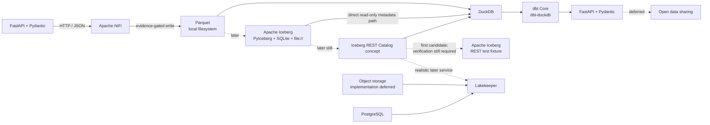
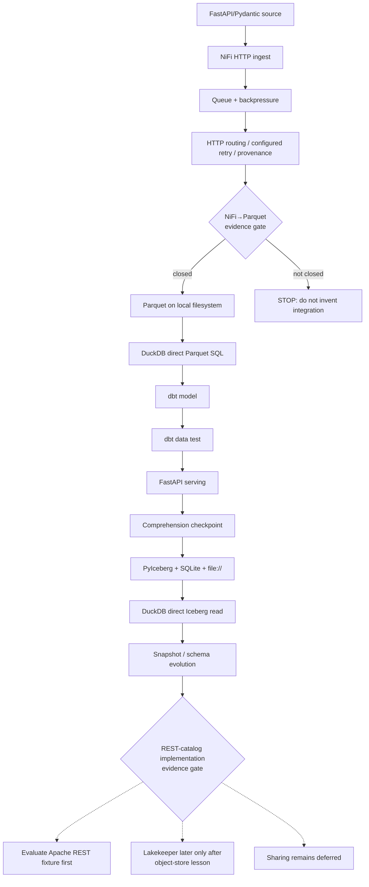

# Evidence-Backed Challenger Review — Minimal Local Data Platform

This document is the **evidence-backed challenger review** of the immutable Researcher brief. It is not the final architecture and does not reconcile the Researcher’s findings on the Researcher’s behalf.

## Challenger Verdict

**REVISE**

The Researcher’s central architecture is substantially sound and salvageable, but the committed brief is not yet strong enough for APPROVE. Independent upstream verification confirms the most important simplifications: local filesystem before object storage, Parquet before Iceberg, PyIceberg with SQLite/local filesystem as a real first Iceberg implementation, DuckDB as a strong inspectable bridge across Parquet and Iceberg, dbt Core + dbt-duckdb as a small inspectable transformation layer, Delta Sharing deferral, MinIO deferral, and a deliberately shallow NiFi→Openflow mapping. See [PyIceberg](https://py.iceberg.apache.org/), [DuckDB Iceberg](https://duckdb.org/docs/current/core_extensions/iceberg/overview), [dbt-duckdb](https://github.com/duckdb/dbt-duckdb), [Delta Sharing](https://github.com/delta-io/delta-sharing), [MinIO](https://github.com/minio/minio), and [Snowflake Openflow](https://docs.snowflake.com/en/user-guide/data-integration/openflow/about).

Three findings prevent approval.

First, the early **NiFi HTTP/JSON→Parquet stage remains evidence-incomplete**. Current Apache sources establish the necessary component capabilities, but no authoritative current assembled flow was found demonstrating the exact integration. This is the Researcher’s own largest early gap, and it sits on the first vertical slice. **No reliable authoritative example found.** Apache also warns that the standard binary does not contain every release NAR, so current-release packaging has to be pinned rather than inferred. See the [NiFi Administration Guide](https://nifi.apache.org/nifi-docs/administration-guide.html), [InvokeHTTP](https://nifi.apache.org/components/org.apache.nifi.processors.standard.InvokeHTTP/), [ConvertRecord](https://nifi.apache.org/components/org.apache.nifi.processors.standard.ConvertRecord/), [PutFile](https://nifi.apache.org/components/org.apache.nifi.processors.standard.PutFile/), and the [NiFi 2.11 Parquet bundle](https://github.com/apache/nifi/tree/rel/nifi-2.11.0/nifi-extension-bundles/nifi-parquet-bundle).

Second, the proposed later **Lakekeeper REST-catalog stage hides a required infrastructure transition**. Lakekeeper currently supports warehouse storage on S3, ADLS Gen2, OneLake, and GCS—not a local-filesystem warehouse—and its getting-started documentation says that creating a warehouse requires an external object store. Its official minimal example also introduces PostgreSQL plus object storage and supporting bootstrap/migration services. Lakekeeper therefore cannot follow the local-filesystem Iceberg lesson exactly as the brief’s stage sequence suggests without first introducing an object-storage concept and implementation. See [Lakekeeper storage](https://docs.lakekeeper.io/docs/latest/storage/) and [Lakekeeper getting started](https://docs.lakekeeper.io/getting-started/).

Third, the Researcher missed a materially smaller official candidate for teaching the **REST-catalog concept**: Apache Iceberg itself ships a REST test fixture. The fixture container defaults to `JdbcCatalog` with SQLite, while the server source defaults to an in-memory SQLite catalog and a temporary local filesystem warehouse when no warehouse is configured. DuckDB’s Iceberg repository explicitly uses the Apache fixture for REST-catalog integration testing, although DuckDB’s assembled Compose fixture currently overrides those local defaults with object storage. That means the Apache fixture deserves investigation before Lakekeeper, but the exact DuckDB + fixture + local-filesystem assembled path is not yet sufficiently established to substitute it blindly. See Apache Iceberg’s [`RESTCatalogServer`](https://github.com/apache/iceberg/blob/c07a081c8ab8687cd0531101db64922f6dbb2de6/open-api/src/testFixtures/java/org/apache/iceberg/rest/RESTCatalogServer.java) and the [DuckDB Iceberg project](https://github.com/duckdb/duckdb-iceberg).

The appropriate correction is therefore **not a wholesale architecture change**. Preserve the initial architecture, strengthen NiFi’s evidence gate and semantics, and change the late catalog sequence from “add Lakekeeper” to “introduce the REST-catalog concept only after an authoritative minimal implementation path has been closed; evaluate the Apache fixture first; retain Lakekeeper for a later realistic catalog-service lesson.”

## Input and Method

I evaluated the immutable Researcher state specified in the Challenger prompt, not the branch head.

| Input | Value |
|---|---|
| Repository | `halkypi/data-platform-lab` |
| Researcher branch | `research/minimal-local-data-platform` |
| Researcher commit | `cffecf68252c08d34f2a0d6ed90f9477fb5f15b8` |
| Path | `research/minimal-local-data-platform.md` |
| Blob read | `2846ec966d3a73a32291fc7deca622419c47d31c` |
| Expected blob | `2846ec966d3a73a32291fc7deca622419c47d31c` |
| Research date | August 21, 2026 |

The Researcher blob was fetched directly by SHA from GitHub. The immutable artifact reviewed was [`research/minimal-local-data-platform.md` at commit `cffecf682...`](https://github.com/halkypi/data-platform-lab/blob/cffecf68252c08d34f2a0d6ed90f9477fb5f15b8/research/minimal-local-data-platform.md), not a moving branch head.

The governing repository documents were reread at the same immutable Researcher commit: [`AGENTS.md`](https://github.com/halkypi/data-platform-lab/blob/cffecf68252c08d34f2a0d6ed90f9477fb5f15b8/AGENTS.md), [`docs/learning-governance.md`](https://github.com/halkypi/data-platform-lab/blob/cffecf68252c08d34f2a0d6ed90f9477fb5f15b8/docs/learning-governance.md), and [`prompts/deep-research.md`](https://github.com/halkypi/data-platform-lab/blob/cffecf68252c08d34f2a0d6ed90f9477fb5f15b8/prompts/deep-research.md). Their constraints were applied throughout: authoritative upstream grounding, explicit refusal to invent unsupported integrations, complexity that must earn its place, and demonstrated understanding per learner minute. The Challenger Deep Research prompt supplied for the session governed the evidence and closure criteria.

The evidence hierarchy was:

1. specifications;
2. official documentation;
3. official project repositories;
4. official runnable examples and quickstarts;
5. project-maintainer material;
6. independent sources only when primary evidence was insufficient.

Only primary upstream sources were used for material technical findings: Apache NiFi documentation/source, Apache Iceberg/PyIceberg documentation/source, DuckDB documentation/source/tests, Lakekeeper documentation/repository, DuckDB Foundation’s `dbt-duckdb` repository plus dbt Labs documentation, the official Delta Sharing repository, the official MinIO repository, and Snowflake Openflow documentation.

Current-version sensitivity matters. Apache lists **NiFi 2.11.0, released August 3, 2026**, as the current NiFi 2 release on the [NiFi downloads page](https://nifi.apache.org/download/).

“Confirmed” below means upstream evidence materially supports the Researcher. “Qualified” means the basic conclusion survives but requires correction. “Overturned” means the evidence changes the decision or stage substantially. Absence of an assembled example is not treated as proof that an integration is technically impossible.

## Evidence Matrix

| Research stream / exact claim tested | Preferred or consulted primary sources | Evidence supporting the Researcher | Evidence overturning or materially qualifying the Researcher | Documented fact | Challenger interpretation | Challenger recommendation | Affected architecture decision | Closure status | Closure rationale |
|---|---|---|---|---|---|---|---|---|---|
| **1. NiFi deserves INCLUDE because queues, backpressure, routing and provenance are inspectable.** | [NiFi User Guide](https://nifi.apache.org/nifi-docs/user-guide.html), [NiFi Administration Guide](https://nifi.apache.org/nifi-docs/administration-guide.html), [NiFi downloads](https://nifi.apache.org/download/) | Connections expose FlowFile queues; backpressure thresholds affect scheduling; provenance is inspectable and supports replay. | NiFi 2.11 requires Java 21, separate content/database/FlowFile/provenance repositories, generated `flow.json.gz` and other runtime state, local HTTPS/security setup, and extension/NAR packaging awareness. | NiFi exposes the requested runtime state, but with a substantial bootstrap surface. | The learning value is real because the lab explicitly wants visible queue/backpressure/provenance state; primary evidence cannot objectively prove the highest possible learning ROI. | Keep NiFi INCLUDE but state bootstrap burden more strongly and separate its runtime concepts precisely. | Apache NiFi INCLUDE and early sequence. | **CLOSED for decision** | Evidence establishes both the unique observable state and the burden strongly enough to retain the decision as a curriculum judgment. |
| **1. Current NiFi can support HTTP/JSON→record→Parquet→filesystem without invention.** | [InvokeHTTP](https://nifi.apache.org/components/org.apache.nifi.processors.standard.InvokeHTTP/), [ConvertRecord](https://nifi.apache.org/components/org.apache.nifi.processors.standard.ConvertRecord/), [PutFile](https://nifi.apache.org/components/org.apache.nifi.processors.standard.PutFile/), [NiFi Parquet bundle](https://github.com/apache/nifi/tree/rel/nifi-2.11.0/nifi-extension-bundles/nifi-parquet-bundle), [Administration Guide](https://nifi.apache.org/nifi-docs/administration-guide.html) | The required supported primitives exist upstream: `InvokeHTTP`, record conversion with a JSON record reader such as `JsonTreeReader`, a Parquet writer such as `ParquetRecordSetWriter`, `PutFile`, and the NiFi 2.11 Parquet NAR/bundle. | No current authoritative assembled tiny HTTP/JSON→Parquet flow was found; Apache warns that the standard binary does not contain every release NAR. | Component capability is established; assembled integration precedent is not. | Separate capabilities must not be treated as proof of a finished flow. | Retain the planned concept, but hard-gate implementation on exact NiFi 2.11 processor/controller-service/NAR verification. | NiFi→Parquet stage. | **PARTIALLY CLOSED** | Primitive support is closed; assembled integration and exact packaging remain open. **No reliable authoritative example found.** |
| **1. The proposed NiFi failure/retry/backpressure lesson is semantically accurate.** | [InvokeHTTP](https://nifi.apache.org/components/org.apache.nifi.processors.standard.InvokeHTTP/), [NiFi User Guide](https://nifi.apache.org/nifi-docs/user-guide.html) | `InvokeHTTP` exposes outcome relationships; NiFi exposes queues, backpressure and provenance replay. | `Retry` relationship routing, automatic relationship retry, processor yielding/penalty, queue backpressure and provenance replay are distinct mechanisms. | These mechanisms exist but are not synonyms. | The original “failure/retry/idempotency” lesson compresses several independently observable concepts. | Rewrite the lesson to distinguish HTTP outcome routing, configured retry, backpressure, and provenance replay. | Stages for failure, retry, idempotency, backpressure. | **CLOSED** | Current Apache documentation is sufficient to establish the distinctions. |
| **1. Local NiFi provides a useful mental model for Snowflake Openflow.** | [Snowflake Openflow](https://docs.snowflake.com/en/user-guide/data-integration/openflow/about), [NiFi User Guide](https://nifi.apache.org/nifi-docs/user-guide.html) | Snowflake explicitly says Openflow is built on/powered by Apache NiFi. | Openflow adds managed security, compliance, observability, maintainability and deployment semantics; one-to-one processor/security/governance/operating transfer is unsupported. | NiFi ancestry is documented; operational equivalence is not. | FlowFile/processor/dataflow concepts transfer safely at a narrow mental-model level. | Keep Openflow runtime REJECT and preserve only a shallow conceptual mapping. | Openflow REJECT; NiFi rationale. | **CLOSED** | Primary Snowflake evidence is sufficient for the narrow conclusion. |
| **2. PyIceberg + SQLite + local filesystem is the smallest authoritative first real Iceberg lesson.** | [PyIceberg](https://py.iceberg.apache.org/), [Apache Iceberg specification](https://iceberg.apache.org/spec/) | Official PyIceberg material demonstrates a SQL catalog backed by SQLite and a `file://` warehouse without another service, with real Iceberg table operations. | PyIceberg describes local filesystem use as a testing/demo topology rather than production-scale deployment. | SQLite + local filesystem is an upstream-supported demo/testing topology that creates genuine Iceberg state. | The production limitation is aligned with, not adverse to, this tiny local learning lab. | Keep PyIceberg + SQLite + filesystem INCLUDE after plain Parquet. | PyIceberg INCLUDE; Iceberg stage order. | **CLOSED** | Direct Apache documentation establishes the required topology and artifacts. |
| **3. DuckDB can read PyIceberg-produced local Iceberg output without the PyIceberg catalog.** | [DuckDB Iceberg overview](https://duckdb.org/docs/current/core_extensions/iceberg/overview), [DuckDB Iceberg project](https://github.com/duckdb/duckdb-iceberg), [PyIceberg](https://py.iceberg.apache.org/) | DuckDB documents catalog-free direct table access as read-only and exposes Iceberg metadata/snapshot inspection; DuckDB’s current Iceberg test corpus generates a PyIceberg SQL-catalog table with SQLite and a `file://` warehouse and reads it with `iceberg_scan(...)`. | The DuckDB Iceberg extension is still experimental; direct-path access is read-only and metadata/version behavior should be pinned to the implementation version. | Catalog-free read access is supported and has direct PyIceberg interoperability coverage; catalog-mediated operations form a separate boundary. | This is unusually strong evidence for “table format ≠ catalog.” | Keep DuckDB central and retain the direct Iceberg read stage; pin the version/evidence when implemented. | DuckDB INCLUDE; Iceberg stages. | **CLOSED** | Direct DuckDB documentation plus upstream interoperability tests materially establish the intended path. |
| **4. Lakekeeper is the right first later REST-catalog implementation.** | [Iceberg REST Catalog specification](https://iceberg.apache.org/rest-catalog-spec/), [Lakekeeper storage](https://docs.lakekeeper.io/docs/latest/storage/), [Lakekeeper getting started](https://docs.lakekeeper.io/getting-started/), [Apache RESTCatalogServer](https://github.com/apache/iceberg/blob/c07a081c8ab8687cd0531101db64922f6dbb2de6/open-api/src/testFixtures/java/org/apache/iceberg/rest/RESTCatalogServer.java), [DuckDB Iceberg project](https://github.com/duckdb/duckdb-iceberg) | Lakekeeper is a real REST catalog implementation with DuckDB precedent and is appropriate for a realistic later catalog-service lesson. | Lakekeeper requires external object storage for a warehouse and its official minimal topology also introduces PostgreSQL plus bootstrap/migration services; Apache Iceberg itself ships a smaller REST test fixture using SQLite/local-filesystem defaults. | Lakekeeper’s supported warehouse storage is external-object-store based; Apache has a materially smaller fixture for the protocol boundary. | Lakekeeper teaches a realistic service plus database/storage/credential concerns, while the Apache fixture may isolate the catalog concept better. | Keep REST Catalog INCLUDE as a concept. Keep Lakekeeper DEFER; remove it as the automatic first REST implementation. Evaluate the Apache fixture first, but keep that concrete path evidence-gated. | Iceberg REST Catalog INCLUDE; Lakekeeper DEFER; remote-catalog stage order. | **PARTIALLY CLOSED** | Decision change is supported, but a complete DuckDB + Apache fixture + local-filesystem assembled path is not yet closed. **No reliable authoritative example found.** |
| **4. Lakekeeper + MinIO specifically lacks authoritative compatibility.** | [Lakekeeper storage](https://docs.lakekeeper.io/docs/latest/storage/) | The Researcher was correct that separate S3 compatibility claims should not be synthesized into a runnable example. | Lakekeeper’s current storage documentation explicitly says S3 support is tested with Minio, which is stronger compatibility evidence than the Researcher stated. | Minio compatibility is documented by Lakekeeper; a current minimal Lakekeeper-provided MinIO assembled example was not located. | Compatibility and a canonical minimal runnable example are different claims. | Correct the wording: compatibility exists, but the minimal assembled example remains unclosed. | Lakekeeper/object-storage evidence wording. | **CLOSED for compatibility; OPEN for minimal assembled example** | Current Lakekeeper documentation resolves compatibility. For the narrower runnable example: **No reliable authoritative example found.** |
| **5. dbt Core + dbt-duckdb earns INCLUDE after plain DuckDB SQL.** | [dbt-duckdb](https://github.com/duckdb/dbt-duckdb), [dbt data tests](https://docs.getdbt.com/docs/build/data-tests) | The adapter documents `pip3 install dbt-duckdb`, supports `dbt-core >=1.8.x` and DuckDB `>=1.0.0`, offers a “super-minimal” `type: duckdb` profile, supports persistent DuckDB via `path`, and can operate over external Parquet. dbt exposes compiled model/test SQL. | It introduces another abstraction layer, but the Researcher already places plain DuckDB SQL first. | dbt adds compiled SQL/materialization/test artifacts that plain SQL alone does not expose as a framework concept. | The marginal learning value is sufficient once the learner already understands raw DuckDB SQL. | Keep dbt Core + dbt-duckdb INCLUDE in the proposed relative order. | dbt INCLUDE and stage placement. | **CLOSED** | Upstream adapter/docs establish small setup and unique inspectable artifacts. |
| **6. No sufficiently small authoritative fully local Delta Sharing path exists for this lab.** | [Delta Sharing repository](https://github.com/delta-io/delta-sharing) | Official reference server/client exists; the documented architecture is cloud/object-storage oriented. The reference server is a small service intended for testing connector implementations, not a complete secure production server. | No official filesystem-only server binding equivalent to this lab’s initial local topology was found. | Reference implementation exists, but the needed fully local binding is not established. | Adding storage emulation solely to satisfy sharing would violate minimality unless sharing itself becomes the learning objective. | Keep Delta Sharing DEFER with a concrete future trigger: a verified authoritative local path or an explicit object-store-backed sharing lesson. | Delta Sharing DEFER; sharing stage. | **CLOSED for DEFER decision** | The absence of the required local path is sufficient to support deferral. **No reliable authoritative example found.** |
| **7. Object storage should be deferred from early Parquet/Iceberg lessons.** | [PyIceberg](https://py.iceberg.apache.org/), [Apache Parquet](https://parquet.apache.org/docs/file-format/), [DuckDB Parquet](https://duckdb.org/docs/current/data/parquet/overview) | Parquet and the first genuine Iceberg lesson work on local filesystem; object keys/S3 APIs/credentials are not necessary for those concepts. | Lakekeeper later introduces a real object-store requirement. | Early file/table concepts do not require object-store semantics; later realistic catalog service may. | Object storage should earn its own lesson rather than appear as ambient infrastructure. | Keep object storage DEFER initially and introduce it only before a technology that actually requires it. | Object storage DEFER; Lakekeeper sequence. | **CLOSED** | Primary docs establish the filesystem-first topology and Lakekeeper establishes the later trigger. |
| **7. MinIO’s current upstream status was characterized accurately.** | [MinIO repository](https://github.com/minio/minio), [Lakekeeper storage](https://docs.lakekeeper.io/docs/latest/storage/) | The official community repository states `THIS REPOSITORY IS NO LONGER MAINTAINED`, community distribution is source-only, and historical precompiled binaries receive no updates. | MinIO can still be technically interoperable with later S3-compatible systems; Lakekeeper explicitly documents testing with Minio. | Maintenance/distribution status and interoperability are separate facts. | The repository status weakens MinIO as a new foundational lab dependency but does not prove incompatibility. | Keep MinIO DEFER and make a fresh object-store product choice only if/when the concept becomes necessary. | MinIO DEFER. | **CLOSED** | Current primary-source status is explicit and sufficient. |

## Verified Findings

### HIGH — The NiFi→Parquet stage is still not orchestrator-ready

**Exact Researcher claim or section:** the early stage “First analytical file” can use Apache NiFi to materialize the HTTP/JSON transaction batch as a real Parquet file on the ordinary local filesystem.

**Challenger conclusion:** **QUALIFIES** the claim. The factual capability argument is credible, but the assembled integration remains insufficiently grounded for implementation under this repository’s rules.

**Direct authoritative evidence:** [`InvokeHTTP`](https://nifi.apache.org/components/org.apache.nifi.processors.standard.InvokeHTTP/) is current Apache NiFi functionality; [`ConvertRecord`](https://nifi.apache.org/components/org.apache.nifi.processors.standard.ConvertRecord/) converts through configured Record Reader/Writer services; the NiFi source contains `JsonTreeReader`; the current NiFi repository contains a Parquet bundle and `ParquetRecordSetWriter`; [`PutFile`](https://nifi.apache.org/components/org.apache.nifi.processors.standard.PutFile/) provides filesystem persistence; and the NiFi 2.11 source tree contains the Parquet NAR/bundle. See the [NiFi 2.11 Parquet bundle](https://github.com/apache/nifi/tree/rel/nifi-2.11.0/nifi-extension-bundles/nifi-parquet-bundle).

The unresolved point is assembly and packaging. Apache’s current [Administration Guide](https://nifi.apache.org/nifi-docs/administration-guide.html) explicitly warns that the binary distributed by Apache mirrors does not contain every NAR file from the release. The Researcher therefore did the right thing by refusing to fabricate the final configuration, but that means this stage still fails the project’s “orchestrator does not invent the integration” success test.

**Documented fact:** the constituent processors/services and Parquet implementation exist.

**Challenger interpretation:** existence of the primitives is not an assembled integration precedent.

**Challenger recommendation:** keep NiFi and Parquet INCLUDE, but make this stage a hard evidence/empirical gate before implementation. Pin the exact NiFi release and exact reader/writer/NAR availability first.

**Effect on architecture or stage order:** no technology replacement yet, but the first vertical slice must stop at this gate if the exact path is not closed.

**Required correction:** explicitly mark the stage as hard-gated and avoid handing an orchestrator a configuration it would have to invent.

**Closure:** **PARTIALLY CLOSED**.

For the exact current tiny `InvokeHTTP → JSON record reader → Parquet writer → PutFile` assembled flow: **No reliable authoritative example found.**

### HIGH — The proposed Lakekeeper stage omits a mandatory storage transition, and Lakekeeper is not the smallest first REST-catalog lesson

**Exact Researcher claim or section:** Lakekeeper is deferred until the remote catalog stage, where DuckDB can discover/query a Lakekeeper-managed table through the Iceberg REST Catalog.

**Challenger conclusion:** **MATERIALLY QUALIFIES** the proposed stage.

**Direct authoritative evidence:** [Lakekeeper storage documentation](https://docs.lakekeeper.io/docs/latest/storage/) lists S3, ADLS Gen2, OneLake, and GCS and says S3 support is tested with AWS and Minio. It does not list a local-filesystem warehouse. [Lakekeeper getting started](https://docs.lakekeeper.io/getting-started/) says an external object store is needed to create a warehouse. The current official minimal Compose topology introduces Lakekeeper, migrations, PostgreSQL, bootstrap/warehouse jobs, object storage (currently SeaweedFS in the example), and additional query/example services.

There is a smaller upstream object the Researcher missed. Apache Iceberg’s own REST test-fixture image defaults to `JdbcCatalog` with SQLite and port 8181. The server source independently defaults to `JdbcCatalog`, an in-memory SQLite URI when none is supplied, and a temporary `file:` warehouse if no warehouse location is configured. See Apache Iceberg’s [`RESTCatalogServer`](https://github.com/apache/iceberg/blob/c07a081c8ab8687cd0531101db64922f6dbb2de6/open-api/src/testFixtures/java/org/apache/iceberg/rest/RESTCatalogServer.java).

The [DuckDB Iceberg project](https://github.com/duckdb/duckdb-iceberg) explicitly treats the Apache Iceberg REST fixture as a local catalog integration target alongside other catalog implementations. This is significant falsifying evidence against the implicit premise that Lakekeeper is the natural first concrete REST-catalog service.

There is an important limitation: DuckDB’s checked-in assembled fixture currently overrides Apache’s local defaults and uses object storage. Thus separate Apache local-filesystem support and DuckDB fixture support are **not** treated as proof of a completed DuckDB + local-filesystem fixture integration.

**Documented fact:** Lakekeeper requires external object storage for a warehouse and brings a database/service bootstrap boundary; Apache Iceberg maintains a smaller REST test fixture capable of SQLite + local filesystem defaults.

**Challenger interpretation:** Lakekeeper teaches a realistic catalog service plus storage/credential/database concerns; the Apache fixture is better aligned with isolating the REST-catalog boundary.

**Challenger recommendation:** REST Catalog stays INCLUDE as a concept. Lakekeeper stays DEFER and should no longer be the automatic first REST implementation. Evaluate the Apache fixture first, but keep the concrete first-REST implementation evidence-gated until two-sided local interoperability is closed.

**Effect on architecture or stage order:** insert an explicit REST-catalog implementation evidence gate; if Lakekeeper is later used, object storage must precede it.

**Required correction:** remove the implied direct local-filesystem→Lakekeeper progression and make the PostgreSQL/object-store transition explicit.

**Closure:** **PARTIALLY CLOSED**.

For a canonical tiny assembled DuckDB + Apache REST fixture + local-filesystem write/read workflow: **No reliable authoritative example found.**

The Researcher’s stronger-sounding “Lakekeeper + MinIO unsupported” concern also needs wording correction. Lakekeeper now explicitly documents Minio as tested S3 storage. That is authoritative compatibility evidence, although a current Lakekeeper-provided *minimal assembled example* using MinIO rather than its current object-storage example was not located. For that narrower runnable-example claim: **No reliable authoritative example found.**

### HIGH — PyIceberg SQLite/local-filesystem Iceberg is directly confirmed

**Exact Researcher claim or section:** use PyIceberg’s documented local SQL catalog plus local filesystem for the first real Iceberg lesson.

**Challenger conclusion:** **CONFIRMS** the claim.

**Direct authoritative evidence:** [PyIceberg](https://py.iceberg.apache.org/) explicitly demonstrates a SQL catalog backed by SQLite and a local `file://` warehouse, including a configuration materially equivalent to:

```text
type = sql
uri = sqlite:///.../pyiceberg_catalog.db
warehouse = file://...
```

The documentation describes local filesystem use as a demonstration/testing topology rather than production-scale storage, which is aligned with this intentionally tiny local learning lab. The [Apache Iceberg specification](https://iceberg.apache.org/spec/) defines the genuine metadata, snapshot, manifest and commit structures produced by a real implementation.

**Documented fact:** SQLite SQL catalog + local filesystem warehouse is an upstream-supported PyIceberg demo/testing topology.

**Challenger interpretation:** this topology is unusually well matched to “files ≠ table” because it introduces real Iceberg state without simultaneously introducing a network service, credentials or object storage.

**Challenger recommendation:** retain **PyIceberg + SQLite + filesystem: INCLUDE**, in the proposed position after plain Parquet.

**Effect on architecture or stage order:** strengthens the Researcher’s ordering.

**Required correction:** preserve the local-demo/testing qualifier; no architecture change.

**Closure:** **CLOSED; Researcher confirmed.**

### HIGH — DuckDB↔PyIceberg local interoperability is more strongly supported than the Researcher demonstrated

**Exact Researcher claim or section:** DuckDB can read an Iceberg table from metadata without the PyIceberg catalog, making “table format ≠ catalog” directly observable.

**Challenger conclusion:** **CONFIRMS and strengthens** the claim.

**Direct authoritative evidence:** [DuckDB Iceberg](https://duckdb.org/docs/current/core_extensions/iceberg/overview) documents direct, catalog-free Iceberg table access and states that this mode is read-only. It also exposes Iceberg snapshot/metadata inspection. More importantly, the current [DuckDB Iceberg project](https://github.com/duckdb/duckdb-iceberg) test corpus contains a data generator that uses PyIceberg with a SQL catalog, SQLite and a `file://` warehouse, creates/appends a table, and a corresponding DuckDB SQL test reads that generated table directly with `iceberg_scan(...)` using its filesystem table location.

That is not two independent compatibility claims; it is direct upstream cross-implementation evidence.

**Documented fact:** DuckDB has upstream tests against Iceberg data created by PyIceberg in the SQLite/`file://` local topology, while direct-path access remains read-only.

**Challenger interpretation:** this is unusually strong evidence for the intended “table format ≠ catalog” lesson.

**Challenger recommendation:** keep DuckDB central and keep the catalog-free stage. Add a version pin/evidence check because the DuckDB Iceberg extension remains experimental.

**Effect on architecture or stage order:** strengthens DuckDB’s position and the PyIceberg→DuckDB sequence.

**Required correction:** add version sensitivity and the read-only boundary explicitly.

**Closure:** **CLOSED; Researcher strongly confirmed.**

### MEDIUM — NiFi’s educational value survives challenge, but “retry” needs much sharper language

**Exact Researcher claim or section:** NiFi earns its complexity because FlowFiles, queues, routing, backpressure, retry behavior and provenance are observable first-class state.

**Challenger conclusion:** **QUALIFIES** the claim but retains INCLUDE.

**Direct authoritative evidence:** [NiFi 2.11](https://nifi.apache.org/download/) requires Java 21. The [Administration Guide](https://nifi.apache.org/nifi-docs/administration-guide.html) documents separate content, database, FlowFile and provenance repositories plus runtime/work state including `flow.json.gz`; current security defaults bind locally and expose HTTPS rather than a trivial unsecured HTTP UI. The [NiFi User Guide](https://nifi.apache.org/nifi-docs/user-guide.html) says a Connection houses a FlowFile Queue, backpressure thresholds can prevent the source component from being scheduled, and provenance can replay a FlowFile back into processing.

[`InvokeHTTP`](https://nifi.apache.org/components/org.apache.nifi.processors.standard.InvokeHTTP/) distinguishes server-error routing to `Retry`, client errors to `No Retry`, and communication/socket errors to `Failure`. A FlowFile landing on a relationship named `Retry` is conceptually separate from configurable automatic relationship retry, processor yielding/penalty, queue backpressure, and manual provenance replay.

**Documented fact:** NiFi has first-class queues, routing, backpressure, provenance and replay at the cost of a Java runtime and multiple persistent repositories/configuration surfaces.

**Challenger interpretation:** primary evidence establishes the state NiFi exposes, but cannot objectively prove that it maximizes learning ROI. That remains a curriculum judgment.

**Challenger recommendation:** keep **NiFi: INCLUDE** because the requested curriculum explicitly prioritizes queue/backpressure/provenance inspection. Raise the bootstrap complexity warning and split the failure lesson into “HTTP outcome routing,” “configured retry,” “backpressure,” and “provenance replay.”

**Effect on architecture or stage order:** NiFi stays early; its lesson design becomes more precise.

**Required correction:** stop using “retry” as an umbrella term for multiple mechanisms.

**Closure:** **CLOSED for the INCLUDE decision**; the Parquet integration remains separately open.

### MEDIUM — dbt Core + dbt-duckdb earns its place after plain DuckDB SQL

**Exact Researcher claim or section:** dbt Core + dbt-duckdb should remain INCLUDE, but only after plain SQL is understood.

**Challenger conclusion:** **CONFIRMS** the claim.

**Direct authoritative evidence:** [`duckdb/dbt-duckdb`](https://github.com/duckdb/dbt-duckdb) documents installation as `pip3 install dbt-duckdb`, supports `dbt-core >=1.8.x` and DuckDB `>=1.0.0`, describes a “super-minimal” profile consisting essentially of `type: duckdb`, supports persistent DuckDB via a path, and can work entirely over external CSV/Parquet/JSON files. It explicitly compiles external Parquet sources into DuckDB `read_parquet(...)` SQL. [dbt data tests](https://docs.getdbt.com/docs/build/data-tests) and dbt Core’s compiled artifacts make analytical assertion SQL inspectable in `target/compiled`.

**Documented fact:** local persistent DuckDB, external Parquet, models and compiled test SQL all have current upstream precedent.

**Challenger interpretation:** dbt adds concepts—model compilation/materialization and analytical assertions—that plain SQL does not expose by itself.

**Challenger recommendation:** retain **dbt Core + dbt-duckdb: INCLUDE** and retain the Researcher’s rule that plain DuckDB SQL precedes it. There is insufficient evidence to require moving dbt behind API serving; that sequencing question is pedagogical rather than an integration failure.

**Effect on architecture or stage order:** unchanged relative order.

**Required correction:** none beyond version pinning at implementation time.

**Closure:** **CLOSED; Researcher confirmed.**

### MEDIUM — Delta Sharing deferral is supported

**Exact Researcher claim or section:** defer Delta Sharing because no authoritative fully local binding to the proposed filesystem/MinIO topology was found.

**Challenger conclusion:** **CONFIRMS** the DEFER decision.

**Direct authoritative evidence:** the official [Delta Sharing repository](https://github.com/delta-io/delta-sharing) describes Delta Sharing as a REST protocol using cloud/object storage such as S3, ADLS or GCS for dataset transfer. Its reference server is a small service for testing connector implementations rather than a complete secure production server.

**Documented fact:** a maintained reference server/client exists and the documented transfer architecture is cloud-storage oriented.

**Challenger interpretation:** adding a storage emulation solely to satisfy the sharing box would violate the project’s minimality rule unless open-sharing itself becomes the next learning objective.

**Challenger recommendation:** keep **Delta Sharing: DEFER**. The future trigger should be a verified official/local reference path—or a later explicit decision to make object-store-backed sharing the concept under study.

**Effect on architecture or stage order:** sharing stays outside the initial complete slice.

**Required correction:** keep the evidence-failure wording and future trigger explicit.

**Closure:** **CLOSED for the DEFER decision**.

For a current authoritative reference-server example sharing this exact filesystem-only local lab: **No reliable authoritative example found.**

### MEDIUM — MinIO’s status was correctly characterized and is now clearer

**Exact Researcher claim or section:** MinIO should not be foundational because its current upstream maintenance/distribution status has changed materially compared with older lakehouse tutorials.

**Challenger conclusion:** **CONFIRMS and strengthens** the factual premise.

**Direct authoritative evidence:** the official [`minio/minio`](https://github.com/minio/minio) repository states `THIS REPOSITORY IS NO LONGER MAINTAINED`, community edition distribution is source-only, and historical precompiled binaries receive no updates. Lakekeeper’s current [storage documentation](https://docs.lakekeeper.io/docs/latest/storage/) separately documents testing of S3 storage with Minio.

**Documented fact:** the historical community repository/distribution changed materially and is no longer maintained, while Minio compatibility can still exist in downstream systems.

**Challenger interpretation:** “can interoperate” and “is the right new learning-lab dependency” are different questions.

**Challenger recommendation:** keep **object storage: DEFER** and **MinIO: DEFER**. Do not select a replacement object store yet; make that technology decision when object storage becomes necessary.

**Effect on architecture or stage order:** unchanged initial architecture; future object-store selection remains open.

**Required correction:** avoid wording that implies technical incompatibility.

**Closure:** **CLOSED; Researcher confirmed.**

### LOW — The NiFi→Openflow mapping is defensible only at the mental-model level

**Exact Researcher claim or section:** local NiFi is useful for understanding Openflow’s underlying model, while Openflow runtime should not be introduced.

**Challenger conclusion:** **CONFIRMS** the narrow claim.

**Direct authoritative evidence:** [Snowflake Openflow documentation](https://docs.snowflake.com/en/user-guide/data-integration/openflow/about) explicitly says Openflow is built on/powered by Apache NiFi while also describing added managed security, compliance, observability and maintainability capabilities.

**Documented fact:** Openflow is built on NiFi and adds managed-product capabilities.

**Challenger interpretation:** processor/FlowFile/dataflow concepts transfer safely; operational equivalence does not.

**Challenger recommendation:** retain **Openflow runtime: REJECT**, with only a narrow conceptual mapping after NiFi is understood.

**Effect on architecture or stage order:** unchanged.

**Required correction:** keep the mapping intentionally shallow.

**Closure:** **CLOSED; Researcher confirmed.**

## Architecture Decision Effects

Most decisions remain intact. The material revision is concentrated at the two integration gates rather than in the central technology stack.

| Concept / technology | Researcher decision | Challenger decision | Sequence effect |
|---|---:|---:|---|
| FastAPI + Pydantic | INCLUDE | **INCLUDE — unchanged** | None from this challenge. |
| HTTP/JSON | INCLUDE | **INCLUDE — unchanged** | None. |
| Apache NiFi | INCLUDE | **INCLUDE — unchanged, stronger complexity warning** | Bootstrap remains early because its queue/provenance concepts are intentional. |
| NiFi→Parquet stage | Planned early | **Retain, but HARD-GATE** | Do not implement until exact NiFi 2.11 packaging and flow are verified; no invented configuration. |
| Parquet + filesystem | INCLUDE | **INCLUDE — unchanged** | Remains before Iceberg/object storage. |
| DuckDB | INCLUDE | **INCLUDE — strengthened** | Direct PyIceberg interoperability now has upstream test evidence. |
| dbt Core + dbt-duckdb | INCLUDE | **INCLUDE — unchanged** | Keep after plain DuckDB SQL. |
| PyIceberg + SQLite + filesystem | INCLUDE | **INCLUDE — strengthened** | Remains first real Iceberg implementation. |
| Iceberg REST Catalog concept | INCLUDE | **INCLUDE — unchanged** | Still comes after local Iceberg metadata. |
| Lakekeeper | DEFER until catalog stage | **DEFER further** | Do not make it the automatic first REST-catalog stage; it introduces PostgreSQL + object storage. |
| Apache Iceberg REST fixture | Not considered | **DEFER pending one focused verification; preferred first candidate** | Investigate before Lakekeeper because its upstream server can use SQLite + local filesystem defaults. |
| Object storage | DEFER | **DEFER — unchanged initially** | Must precede Lakekeeper if Lakekeeper is eventually introduced. |
| MinIO | DEFER | **DEFER — strengthened** | Do not make the unmaintained community server the default by inertia. |
| Delta Sharing | DEFER | **DEFER — unchanged** | Sharing remains an explicit unresolved endpoint. |
| Openflow runtime | REJECT | **REJECT — unchanged** | Conceptual NiFi mapping only. |

The evidence-supported minimal architecture is therefore still predominantly the Researcher’s architecture, with the remote-catalog boundary made explicit as an evidence gate:



The principal sequence correction is narrow:



This preserves the Researcher’s most important pedagogical ordering:

`physical Parquet file → real Iceberg table metadata → remote catalog boundary`

The revision is about **which evidence closes the boundaries**, not about replacing that progression.

## Findings That Withstood Challenge

The most consequential Researcher conclusions that withstood independent challenge are unusually strong.

| Conclusion that survived | Challenger assessment |
|---|---|
| **Filesystem before object storage** | Strongly supported. PyIceberg provides a `file://` learning topology; no early lesson requires S3 semantics. See [PyIceberg](https://py.iceberg.apache.org/). |
| **Parquet before Iceberg; Iceberg before catalog** | Remains the clearest separation of file, table state, and catalog-mediated management. DuckDB’s direct read-only Iceberg mode makes the latter distinction empirical. See [DuckDB Iceberg](https://duckdb.org/docs/current/core_extensions/iceberg/overview). |
| **PyIceberg is the missing simplifier** | Directly confirmed by Apache documentation. See [PyIceberg](https://py.iceberg.apache.org/). |
| **DuckDB is unusually valuable for inspectability/interoperability** | Strengthened by direct DuckDB tests against PyIceberg-generated local tables. See [DuckDB Iceberg project](https://github.com/duckdb/duckdb-iceberg). |
| **NiFi should not own analytical transformation merely because it can transform** | Remains a sound responsibility-boundary recommendation; NiFi’s unique curriculum value is its visible dataflow state. See [NiFi User Guide](https://nifi.apache.org/nifi-docs/user-guide.html). |
| **Plain DuckDB SQL before dbt** | Strongly supported by dbt-duckdb’s small incremental configuration and inspectable compiled SQL. See [dbt-duckdb](https://github.com/duckdb/dbt-duckdb) and [dbt data tests](https://docs.getdbt.com/docs/build/data-tests). |
| **Delta Sharing should not be forced into the first slice** | Supported by the reference implementation’s cloud-storage-oriented architecture and absence of the required local binding. See [Delta Sharing](https://github.com/delta-io/delta-sharing). |
| **MinIO should not be foundational** | Strengthened by the repository’s current unmaintained/source-only state. See [MinIO](https://github.com/minio/minio). |
| **Openflow mapping must be shallow** | Confirmed by Snowflake’s simultaneous NiFi ancestry and managed-service differentiation. See [Snowflake Openflow](https://docs.snowflake.com/en/user-guide/data-integration/openflow/about). |

## Remaining Evidence Gaps

The remaining evidence gaps are small in number but consequential.

| Open question | Status | Smallest further research or empirical verification needed |
|---|---|---|
| Exact NiFi 2.11.0 `InvokeHTTP → JSON record reader → Parquet writer → PutFile` flow and NAR availability | **OPEN / HIGH** | One authoritative current Apache example, or a narrow empirical verification against the exact upstream release documenting every required processor/controller service/NAR. Until then: **No reliable authoritative example found.** |
| Exact DuckDB + Apache Iceberg REST fixture + local-filesystem catalog-managed read/write path | **OPEN / MEDIUM** | A direct upstream test/example, or narrow empirical verification using the fixture’s documented local defaults and released/pinned DuckDB Iceberg extension. Do not infer from separate support claims. **No reliable authoritative example found.** |
| Which object-store implementation should accompany Lakekeeper if that lesson is later authorized | **OPEN / LOW now** | No research needed until object-storage semantics become the actual lesson. Lakekeeper’s supported storage interface is established; technology selection can remain deferred. See [Lakekeeper storage](https://docs.lakekeeper.io/docs/latest/storage/). |
| Exact fully local Delta Sharing binding for this lab | **OPEN / LOW now** | Official reference-server support/example for an acceptable local backend. Until then: **No reliable authoritative example found.** See [Delta Sharing](https://github.com/delta-io/delta-sharing). |
| DuckDB Iceberg extension stability over the eventual implementation period | **ONGOING / MEDIUM** | Pin the version used by the lab and recheck current extension documentation/repository status because upstream still marks the extension experimental. See [DuckDB Iceberg project](https://github.com/duckdb/duckdb-iceberg). |

## Quality Audit

The immutable Researcher brief scores **86 / 100**.

| Dimension | Score | Challenger assessment |
|---|---:|---|
| **Scope coverage** | **24 / 25** | Nearly every requested concept, technology, deferral and integration boundary is covered. The principal omission is the smaller Apache REST fixture as a candidate for the remote-catalog lesson. |
| **Evidence integrity and claim-source fit** | **24 / 30** | Primary-source discipline is generally strong and unsupported integrations are usually called out correctly. Deductions are required for the still-unclosed critical NiFi→Parquet path, incomplete Lakekeeper storage dependency, overly broad wording around Lakekeeper+MinIO support, and insufficient direct evidence originally supplied for PyIceberg→DuckDB interoperability despite that evidence now existing upstream. |
| **Decision relevance** | **19 / 20** | The brief makes concrete, useful INCLUDE/DEFER/REJECT decisions and materially simplifies the original hypothesis. Most survive challenge. |
| **Critical challenge and minimality** | **11 / 15** | Strong on removing early MinIO and separating PyIceberg from REST catalog infrastructure. Weaker on challenging Lakekeeper against Apache’s own much smaller REST fixture and on fully closing NiFi’s bootstrap/integration cost before defending it. |
| **Learning and orchestrator utility** | **8 / 10** | The staged `TX001` trace and comprehension checkpoints are excellent. Two stages still cannot safely be handed to an orchestrator as written: NiFi→Parquet lacks assembled precedent, and Lakekeeper requires a previously unstated object-storage transition. |
| **Total** | **86 / 100** | Below the 90-point APPROVE threshold; central design remains sound. |

### Deductions

- **Scope coverage: −1** because the Researcher did not consider Apache Iceberg’s own smaller REST test fixture as a candidate for the remote-catalog concept. Evidence: [`RESTCatalogServer`](https://github.com/apache/iceberg/blob/c07a081c8ab8687cd0531101db64922f6dbb2de6/open-api/src/testFixtures/java/org/apache/iceberg/rest/RESTCatalogServer.java).
- **Evidence integrity and claim-source fit: −6** because the NiFi→Parquet assembled path remains unclosed; Lakekeeper’s object-storage dependency was omitted from the stage sequence; Lakekeeper+MinIO compatibility was understated; and stronger direct DuckDB↔PyIceberg interoperability evidence existed upstream but was not used. Evidence: [NiFi Administration Guide](https://nifi.apache.org/nifi-docs/administration-guide.html), [Lakekeeper storage](https://docs.lakekeeper.io/docs/latest/storage/), [Lakekeeper getting started](https://docs.lakekeeper.io/getting-started/), and [DuckDB Iceberg project](https://github.com/duckdb/duckdb-iceberg).
- **Decision relevance: −1** because the central decisions are actionable and mostly survive challenge, but the first concrete REST-catalog implementation decision needs revision. Evidence: [Lakekeeper getting started](https://docs.lakekeeper.io/getting-started/) and Apache [`RESTCatalogServer`](https://github.com/apache/iceberg/blob/c07a081c8ab8687cd0531101db64922f6dbb2de6/open-api/src/testFixtures/java/org/apache/iceberg/rest/RESTCatalogServer.java).
- **Critical challenge and minimality: −4** because the brief did not sufficiently challenge Lakekeeper against the smaller Apache fixture and defended the NiFi early path before closing the most consequential assembled integration. Evidence: [NiFi Parquet bundle](https://github.com/apache/nifi/tree/rel/nifi-2.11.0/nifi-extension-bundles/nifi-parquet-bundle), [NiFi Administration Guide](https://nifi.apache.org/nifi-docs/administration-guide.html), and Apache [`RESTCatalogServer`](https://github.com/apache/iceberg/blob/c07a081c8ab8687cd0531101db64922f6dbb2de6/open-api/src/testFixtures/java/org/apache/iceberg/rest/RESTCatalogServer.java).
- **Learning and orchestrator utility: −2** because two planned stages still require evidence closure before they can be handed safely to an orchestrator: the early NiFi→Parquet stage and the later REST-catalog implementation. Evidence: [NiFi Administration Guide](https://nifi.apache.org/nifi-docs/administration-guide.html), [Lakekeeper storage](https://docs.lakekeeper.io/docs/latest/storage/), and Apache [`RESTCatalogServer`](https://github.com/apache/iceberg/blob/c07a081c8ab8687cd0531101db64922f6dbb2de6/open-api/src/testFixtures/java/org/apache/iceberg/rest/RESTCatalogServer.java).

### Hard-Gate Audit

| Hard gate | Result | Evidence-backed assessment |
|---|---|---|
| Every requested research stream is addressed | **PASS** | All seven Challenger research streams are represented in the evidence matrix and findings. |
| Every material Challenger finding has direct authoritative support | **PASS** | HIGH/MEDIUM findings cite Apache, DuckDB, Lakekeeper, dbt, Delta Sharing, MinIO or Snowflake primary sources directly. |
| No integration or runnable example is invented | **PASS** | Unclosed NiFi→Parquet, Apache REST-fixture local DuckDB path, and filesystem-only Delta Sharing paths are explicitly reported as unsupported rather than filled with recipes. |
| Facts, interpretations and recommendations are distinguishable | **PASS** | Each material evidence record separates documented fact, Challenger interpretation and Challenger recommendation. |
| Unsupported combinations are explicitly identified | **PASS** | The review uses **No reliable authoritative example found.** for the material unsupported assembled paths. |
| No named decision is silently omitted | **PASS** | Every Researcher decision that could materially change is preserved or explicitly changed in Architecture Decision Effects. |
| No unresolved HIGH finding remains | **FAIL** | The NiFi→Parquet assembled integration is still OPEN/HIGH and lies on the initial vertical slice. |
| Quality score reaches APPROVE threshold | **FAIL** | Independent score is **86/100**, below the required 90/100. |

The hard-gate result is therefore mixed rather than catastrophic. All named architecture decisions are present; unsupported combinations are identified rather than fabricated; facts, interpretations and recommendations are distinguished; and the core PyIceberg/DuckDB path has strong authoritative support. However, one **HIGH** unresolved finding remains on the initial vertical slice—NiFi→Parquet—and the later Lakekeeper stage cannot be implemented as described without introducing an omitted infrastructure dependency.

Accordingly, **REVISE** is the evidence-backed verdict: preserve the central architecture, tighten NiFi semantics and its Parquet evidence gate, preserve the strongly verified PyIceberg→DuckDB progression, remove Lakekeeper as the assumed first REST-catalog implementation, explicitly account for Lakekeeper’s PostgreSQL/object-store boundary, and keep sharing and object-store product selection deferred until their concepts earn a learning stage.
