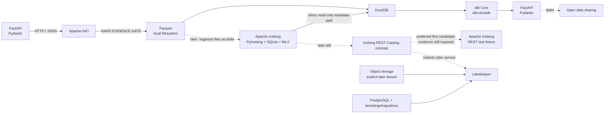
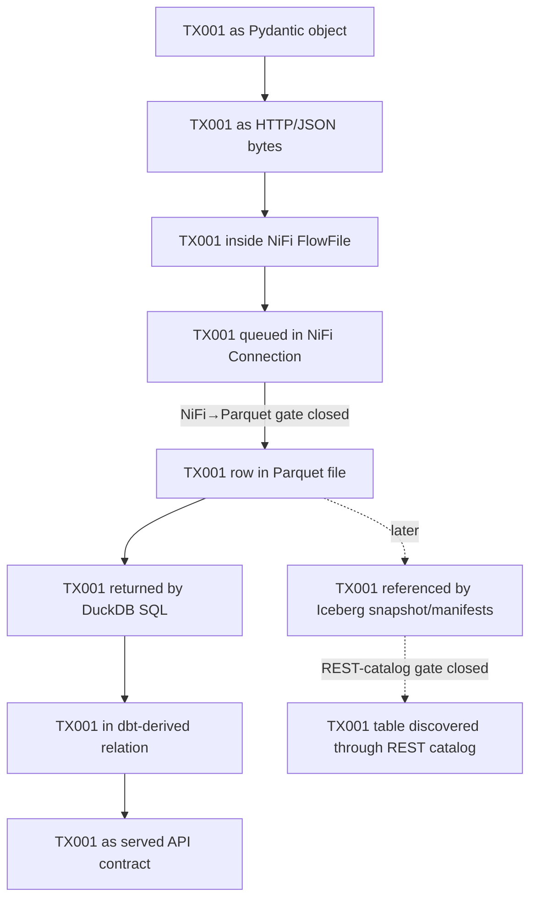

# Minimal Local Data Platform Learning Lab — Reconciled Research Brief

This document preserves the **initial Researcher evidence state** and incorporates the learner-approved reconciliation of the evidence-backed Challenger review. It is **not the final architecture** and it is **not a claim that implementation is ready**. It records the current evidence, decisions, unresolved integration gates, and proposed learning sequence for later Steward review.

The governing objective remains stronger than “build a modern stack”:

> **Maximize demonstrated understanding per minute of learner time.**

The repository must therefore optimize for understanding per line of code/configuration, introduce roughly one observable concept per Git commit, keep `TX001` traceable through every representation, and stop rather than invent unsupported integrations. See [`AGENTS.md`](../AGENTS.md), [`docs/learning-governance.md`](../docs/learning-governance.md), and [`prompts/deep-research.md`](../prompts/deep-research.md).

The initial architecture remains substantially sound, but the reconciliation changes two important integration boundaries:

1. **Keep Apache NiFi, but treat its runtime/bootstrap burden as material.** NiFi 2.11.x brings Java/runtime repositories, generated state, HTTPS/security configuration, and extension/NAR packaging concerns. It still earns its place because FlowFiles, queues, routing, backpressure, and provenance are explicit learning objectives. See the [NiFi User Guide](https://nifi.apache.org/nifi-docs/user-guide.html), [Administration Guide](https://nifi.apache.org/nifi-docs/administration-guide.html), and [downloads page](https://nifi.apache.org/download/).
2. **Do not conflate NiFi recovery mechanisms.** HTTP outcome routing, configured retry, queue backpressure, provenance replay, and idempotency are distinct concepts. [`InvokeHTTP`](https://nifi.apache.org/components/org.apache.nifi.processors.standard.InvokeHTTP/) and the [NiFi User Guide](https://nifi.apache.org/nifi-docs/user-guide.html) support those distinctions.
3. **Make NiFi→Parquet a hard evidence gate.** Apache provides the relevant primitives, including [`InvokeHTTP`](https://nifi.apache.org/components/org.apache.nifi.processors.standard.InvokeHTTP/), [`ConvertRecord`](https://nifi.apache.org/components/org.apache.nifi.processors.standard.ConvertRecord/), [`PutFile`](https://nifi.apache.org/components/org.apache.nifi.processors.standard.PutFile/), JSON record readers, and the [NiFi 2.11 Parquet bundle](https://github.com/apache/nifi/tree/rel/nifi-2.11.0/nifi-extension-bundles/nifi-parquet-bundle). But no authoritative current assembled tiny HTTP/JSON→Parquet flow was found, and Apache warns that the standard binary does not include every release NAR. **No reliable authoritative example found.**
4. **Keep Parquet before Iceberg, and Iceberg before a remote catalog.** The [Apache Parquet file-format documentation](https://parquet.apache.org/docs/file-format/) exposes the physical file structure. The [Apache Iceberg specification](https://iceberg.apache.org/spec/) then makes table state inspectable through metadata, snapshots, manifest lists, manifests, and data files.
5. **Keep PyIceberg + SQLite + `file://` as the first real Iceberg implementation.** Apache's [PyIceberg documentation](https://py.iceberg.apache.org/) demonstrates this as a legitimate local demonstration/testing topology without a separate catalog service or object store.
6. **Strengthen the DuckDB↔PyIceberg conclusion.** DuckDB documents direct catalog-free Iceberg reads, and the upstream [`duckdb/duckdb-iceberg`](https://github.com/duckdb/duckdb-iceberg) test corpus exercises Iceberg data created through PyIceberg using a SQLite SQL catalog and local `file://` warehouse. Direct-path access is read-only, and the extension remains version-sensitive/experimental. See [DuckDB Iceberg](https://duckdb.org/docs/current/core_extensions/iceberg/overview).
7. **Keep dbt Core + dbt-duckdb after plain DuckDB SQL.** [`duckdb/dbt-duckdb`](https://github.com/duckdb/dbt-duckdb) provides a small local adapter surface and inspectable compiled SQL; [dbt data tests](https://docs.getdbt.com/docs/build/data-tests) provide an explicit analytical quality layer.
8. **Do not make Lakekeeper the assumed first REST-catalog implementation.** Lakekeeper is a legitimate later catalog service, but its current documentation requires external object storage for a warehouse and its supported setup introduces PostgreSQL plus bootstrap/migration/service concerns. See [Lakekeeper storage](https://docs.lakekeeper.io/docs/latest/storage/) and [getting started](https://docs.lakekeeper.io/getting-started/).
9. **Evaluate Apache Iceberg's REST test fixture before Lakekeeper.** Apache maintains [`RESTCatalogServer`](https://github.com/apache/iceberg/blob/c07a081c8ab8687cd0531101db64922f6dbb2de6/open-api/src/testFixtures/java/org/apache/iceberg/rest/RESTCatalogServer.java), whose server defaults can use SQLite and temporary local filesystem storage. DuckDB uses the Apache fixture as an integration target upstream, but the exact DuckDB + fixture + local-filesystem assembled path is still unclosed. **No reliable authoritative example found.**
10. **Keep object storage, MinIO, and Delta Sharing deferred.** Lakekeeper documents Minio-tested S3 compatibility, but that does not make MinIO the right current lab default; the official [`minio/minio`](https://github.com/minio/minio) repository is no longer maintained in its historical community-server form. Delta Sharing has an official protocol/reference implementation, but no authoritative filesystem-only binding for this exact lab was found. See [`delta-io/delta-sharing`](https://github.com/delta-io/delta-sharing).

## Recommended Minimal Architecture

The recommendation is **not one permanently running stack**. It is a curriculum architecture whose components appear only when the concept they teach becomes necessary.

**Proposed lab design:** complete the small upper vertical slice first. Add Iceberg only after `TX001` is already visible as a Parquet row and directly queryable. Add a remote catalog only after real Iceberg metadata has been inspected without one.

This architecture deliberately introduces storage abstractions separately:

`Parquet file → Iceberg table metadata → remote catalog protocol/service`

The ordering is supported by the underlying standards. Parquet is a column-oriented file format whose row groups, column chunks, and file metadata can be inspected through the [Parquet file-format documentation](https://parquet.apache.org/docs/file-format/) and DuckDB's [Parquet metadata functions](https://duckdb.org/docs/current/data/parquet/metadata). Iceberg then organizes data files through metadata, snapshots, manifest lists, manifests, and atomic table-state updates defined in the [Iceberg specification](https://iceberg.apache.org/spec/).

**Research recommendation:** do **not** initially put Parquet behind an S3-compatible API. `find`, `ls`, ordinary file paths, and DuckDB metadata functions expose the physical-file lesson with less infrastructure. Object storage should appear only when object keys, S3 APIs, credentials, or a later technology requirement are themselves the lesson.

**Research recommendation:** do **not** initially use NiFi's Iceberg capability even though NiFi has an upstream [`PutIcebergRecord`](https://nifi.apache.org/components/org.apache.nifi.processors.iceberg.PutIcebergRecord/) processor. That shortcut would collapse ingest/serialization, physical-file creation, and table-snapshot commit before the learner has separated those concepts.

**Research recommendation:** the first REST-catalog implementation is intentionally unresolved. The protocol remains INCLUDE, but no concrete remote-catalog runtime is authorized until the evidence gate closes.

The core conceptual distinctions remain **responsibility boundaries rather than absolute product boundaries**. NiFi can transform data; DuckDB can persist and compute; APIs can both serve applications and implement sharing protocols. The curriculum should always ask which responsibility is being exercised now and which artifact owns `TX001`.

## Decisions

`INCLUDE` means the concept belongs in the planned learning path, though not necessarily in the first commit. `DEFER` means it is deliberately outside the initial slice or awaits an evidence/learning trigger. `REJECT` means it should not be used as a lab runtime under the present objective.

| Concept | Technology | Decision | Why | Authoritative foundation |
|---|---|---:|---|---|
| Source API | **FastAPI** | **INCLUDE** | Tiny way to expose HTTP, JSON, schemas and typed application objects. | [FastAPI request body](https://fastapi.tiangolo.com/tutorial/body/) |
| Application contract | **Pydantic** | **INCLUDE** | Teaches application-boundary validation and typed Python objects. | [Pydantic models](https://docs.pydantic.dev/latest/concepts/models/) |
| Transport | **HTTP + JSON** | **INCLUDE** | Inspectable with `curl`; nearly zero infrastructure. | [FastAPI request body](https://fastapi.tiangolo.com/tutorial/body/), [NiFi InvokeHTTP](https://nifi.apache.org/components/org.apache.nifi.processors.standard.InvokeHTTP/) |
| Ingestion / movement | **Apache NiFi 2.11.x** | **INCLUDE** | Explicitly exposes FlowFiles, queues/connections, routing, backpressure and provenance. Runtime/bootstrap burden is material and must be reported rather than hidden. | [NiFi User Guide](https://nifi.apache.org/nifi-docs/user-guide.html), [Administration Guide](https://nifi.apache.org/nifi-docs/administration-guide.html), [downloads](https://nifi.apache.org/download/) |
| NiFi analytical-file write | **NiFi → Parquet → filesystem** | **INCLUDE / HARD-GATED** | Required component primitives exist upstream, but the current assembled path and exact NAR packaging are not closed. Do not implement by inference. | [InvokeHTTP](https://nifi.apache.org/components/org.apache.nifi.processors.standard.InvokeHTTP/), [ConvertRecord](https://nifi.apache.org/components/org.apache.nifi.processors.standard.ConvertRecord/), [PutFile](https://nifi.apache.org/components/org.apache.nifi.processors.standard.PutFile/), [2.11 Parquet bundle](https://github.com/apache/nifi/tree/rel/nifi-2.11.0/nifi-extension-bundles/nifi-parquet-bundle) |
| Enterprise analogue | **Snowflake Openflow runtime** | **REJECT** | Local runtime unnecessary. Keep only a shallow NiFi mental-model mapping. | [Snowflake Openflow](https://docs.snowflake.com/en/user-guide/data-integration/openflow/about) |
| Analytical file format | **Apache Parquet** | **INCLUDE** | Makes JSON bytes vs analytical columnar file concrete. | [Parquet format](https://parquet.apache.org/docs/file-format/), [metadata](https://parquet.apache.org/docs/file-format/metadata/) |
| First physical storage | **Local filesystem** | **INCLUDE** | Smallest and most inspectable physical-storage substrate. | [PyIceberg](https://py.iceberg.apache.org/) |
| Local object store | **MinIO** | **DEFER** | Object-storage semantics are unnecessary for early Parquet/Iceberg lessons; current upstream maintenance/distribution status weakens it as a default dependency. | [`minio/minio`](https://github.com/minio/minio) |
| Open table format | **Apache Iceberg** | **INCLUDE** | Teaches files ≠ tables, snapshots, manifests, table-state commits and evolution. | [Iceberg specification](https://iceberg.apache.org/spec/) |
| First real Iceberg implementation | **PyIceberg + SQLite + `file://`** | **INCLUDE** | Upstream-supported demo/testing topology with genuine Iceberg state and no separate catalog service/object store. | [PyIceberg](https://py.iceberg.apache.org/) |
| Local Iceberg interoperability | **DuckDB Iceberg direct path** | **INCLUDE** | Direct upstream tests cover PyIceberg-created local tables. Direct-path mode is read-only and version-sensitive. | [DuckDB Iceberg](https://duckdb.org/docs/current/core_extensions/iceberg/overview), [`duckdb/duckdb-iceberg`](https://github.com/duckdb/duckdb-iceberg) |
| Catalog protocol | **Iceberg REST Catalog** | **INCLUDE** | Important for teaching table format ≠ network catalog service. | [Iceberg REST Catalog spec](https://iceberg.apache.org/rest-catalog-spec/) |
| First concrete REST-catalog candidate | **Apache Iceberg REST test fixture** | **DEFER pending evidence** | Smaller upstream candidate than Lakekeeper; local SQLite/filesystem defaults exist, but exact DuckDB assembled local path is unclosed. | [`RESTCatalogServer`](https://github.com/apache/iceberg/blob/c07a081c8ab8687cd0531101db64922f6dbb2de6/open-api/src/testFixtures/java/org/apache/iceberg/rest/RESTCatalogServer.java), [`duckdb/duckdb-iceberg`](https://github.com/duckdb/duckdb-iceberg) |
| Realistic later REST catalog | **Lakekeeper** | **DEFER** | Legitimate later service, but requires external object storage and adds PostgreSQL/bootstrap/migration/service concerns. | [Lakekeeper storage](https://docs.lakekeeper.io/docs/latest/storage/), [getting started](https://docs.lakekeeper.io/getting-started/) |
| Analytical compute | **DuckDB** | **INCLUDE** | Queries Parquet directly, exposes Parquet metadata, and reads Iceberg directly or through catalogs. | [DuckDB Parquet](https://duckdb.org/docs/current/data/parquet/overview), [DuckDB Iceberg](https://duckdb.org/docs/current/core_extensions/iceberg/overview) |
| Transformation | **dbt Core + dbt-duckdb** | **INCLUDE** | Adds inspectable model compilation/materialization after plain SQL is understood. | [`duckdb/dbt-duckdb`](https://github.com/duckdb/dbt-duckdb), [dbt DuckDB setup](https://docs.getdbt.com/docs/core/connect-data-platform/duckdb-setup) |
| Data tests | **dbt tests** | **INCLUDE** | Separates analytical assertions from application-boundary validation. | [dbt data tests](https://docs.getdbt.com/docs/build/data-tests) |
| Serving | **Reuse FastAPI + Pydantic** | **INCLUDE** | Reuses a known application boundary instead of adding another framework. | [FastAPI](https://fastapi.tiangolo.com/tutorial/body/), [Pydantic](https://docs.pydantic.dev/latest/concepts/models/) |
| Open sharing | **Delta Sharing** | **DEFER** | Protocol and reference implementation are real, but no authoritative filesystem-only path for this exact lab was found. | [`delta-io/delta-sharing`](https://github.com/delta-io/delta-sharing) |

### Architectural challenge

**NiFi remains INCLUDE, but not because it is lightweight.** It is intentionally expensive relative to the rest of the lab. NiFi 2.11.x requires a Java runtime and maintains multiple persistent repositories/runtime artifacts. The [Administration Guide](https://nifi.apache.org/nifi-docs/administration-guide.html) also documents extension/NAR packaging concerns. That burden earns its place only because the curriculum explicitly wants visible queue, backpressure, routing and provenance state.

**NiFi recovery concepts must not be collapsed.** [`InvokeHTTP`](https://nifi.apache.org/components/org.apache.nifi.processors.standard.InvokeHTTP/) distinguishes outcome relationships. A FlowFile routed to a relationship named `Retry` is not the same thing as configurable retry behavior, processor yielding/penalty, connection backpressure, manual provenance replay, or application-level idempotency.

**MinIO remains unnecessary at the beginning.** The file/storage lesson survives without object storage. The current [`minio/minio`](https://github.com/minio/minio) repository status is a second reason not to make it foundational, but it does not imply S3 incompatibility. Lakekeeper currently documents Minio-tested S3 compatibility in [its storage documentation](https://docs.lakekeeper.io/docs/latest/storage/).

**Lakekeeper is a good later technology at a later lesson.** It teaches a realistic remote catalog service plus database/storage/credential concerns. It should not be used to teach the first REST boundary when Apache itself provides a smaller fixture candidate.

**PyIceberg remains the crucial simplifier.** It separates genuine Iceberg metadata from remote-catalog and object-storage infrastructure. Its local filesystem topology is a demonstration/testing topology, which aligns with this intentionally tiny local learning lab rather than weakening the choice.

**DuckDB's position is strengthened.** Current upstream evidence directly covers PyIceberg-created local tables, making `table format ≠ catalog` empirically inspectable. The read-only direct-path boundary and extension version sensitivity must be explicit.

## Missing Concepts

The classifications below are **research recommendations**. “Acknowledge only” means the concept is named and distinguished but should not earn infrastructure yet.

| Missing concept | Classification | How to teach it with the proposed stack |
|---|---|---|
| **Orchestration** | **ACKNOWLEDGE ONLY** | Explain that NiFi schedules processors/dataflows but do not equate that with a dedicated cross-system workflow orchestrator. Add one only when dependencies/backfills across independent jobs become the lesson. |
| **Incremental ingestion** | **DEMONSTRATE LATER** | Add one new source transaction and make the learner identify what state decides “new.” |
| **CDC** | **ACKNOWLEDGE ONLY** | A static HTTP fixture has no database log. Teach CDC only with a mutable source whose changes can genuinely be captured. |
| **Idempotency** | **TEACH IMMEDIATELY** | Replay/redeliver `TX001` and inspect duplicate consequences. Keep it conceptually separate from NiFi retry/replay mechanics. |
| **HTTP outcome routing** | **TEACH IMMEDIATELY** | Force success, server error, client error, and communication-error conditions and inspect `InvokeHTTP` relationships. See [InvokeHTTP](https://nifi.apache.org/components/org.apache.nifi.processors.standard.InvokeHTTP/). |
| **Configured retry** | **DEMONSTRATE AFTER ROUTING** | Demonstrate whatever retry mechanism is explicitly configured in the pinned NiFi release; do not infer it from a relationship name. |
| **Backpressure** | **TEACH IMMEDIATELY** | Accumulate queued FlowFiles and inspect object-count/data-size thresholds and upstream scheduling response. See [NiFi User Guide](https://nifi.apache.org/nifi-docs/user-guide.html). |
| **Provenance replay** | **DEMONSTRATE SEPARATELY** | Replay a provenance event only after routing/retry semantics are understood; distinguish manual replay from automatic retry. |
| **Schema evolution** | **DEMONSTRATE LATER** | Add one field only after a real Iceberg table exists and inspect old/new table metadata. See [Iceberg spec](https://iceberg.apache.org/spec/). |
| **Transactions** | **DEMONSTRATE LATER** | Teach table-state commit/isolation at the Iceberg metadata/snapshot boundary rather than adding another database product. |
| **Partitioning** | **ACKNOWLEDGE ONLY initially** | Three to ten records do not justify performance partitioning. Later inspect Iceberg partition metadata/evolution. |
| **Lineage** | **ACKNOWLEDGE ONLY end-to-end** | NiFi provenance shows in-NiFi lineage; do not call that complete cross-system lineage. |
| **Provenance** | **TEACH IMMEDIATELY** | Inspect event history, FlowFile lineage and replayable events in NiFi. |
| **Observability** | **TEACH IMMEDIATELY** | Use HTTP responses, NiFi status/queues/provenance, files, DuckDB queries, dbt artifacts and ordinary logs. No dedicated platform is needed. |
| **Data contracts** | **TEACH IMMEDIATELY** | Pydantic/FastAPI make typed objects, validation failures and OpenAPI/JSON Schema visible. |
| **Data quality** | **DEMONSTRATE LATER** | Add a dbt assertion after transformation exists so contract validation is visibly distinct from analytical data-quality testing. |
| **Authentication / authorization** | **ACKNOWLEDGE ONLY initially** | Synthetic loopback traffic does not justify an identity system. Make auth real only when a trust boundary appears. |
| **Secrets** | **ACKNOWLEDGE ONLY initially** | Keep the repository secret-free. Introduce credentials only when a real catalog/sharing boundary requires them. |
| **Interoperability** | **DEMONSTRATE LATER** | Read the same Parquet and Iceberg artifacts through more than one real implementation. |
| **Ownership / governance** | **ACKNOWLEDGE ONLY initially** | Make ownership concrete per representation without adding a governance platform. |

The requested conceptual distinctions remain useful with qualifications.

**Ingestion ≠ transformation** is an architectural responsibility distinction, not a statement that NiFi cannot transform. Constrain NiFi to transport/routing/record serialization for this lab and reserve deliberate analytical SQL transformation for DuckDB/dbt.

**Storage ≠ compute** is also conceptual. DuckDB can persist relations, but in the early stages the authoritative bytes remain in external Parquet/Iceberg artifacts.

**Files ≠ tables** and **table format ≠ catalog** remain the strongest distinctions. The [Iceberg specification](https://iceberg.apache.org/spec/) defines metadata/snapshots/manifests over data files; DuckDB can read a table directly from metadata without the PyIceberg catalog, while remote catalog-managed operations cross a separate boundary.

**Schema validation ≠ data-quality testing** remains explicit: Pydantic validates an application boundary; dbt tests evaluate analytical assertions.

**API serving ≠ data sharing** remains a responsibility distinction. Both can use HTTP, but application-specific API contracts and interoperable sharing protocols solve different problems.

**Orchestration ≠ data movement** remains worth acknowledging without adding Airflow solely to create a visually pure separation.

## Canonical Examples

The table distinguishes authoritative component/capability evidence from an assembled runnable integration. Separate compatibility claims are never combined into a supported recipe by inference.

| Requested combination | Authoritative precedent | Assessment |
|---|---|---|
| **NiFi + HTTP** | [Apache NiFi InvokeHTTP](https://nifi.apache.org/components/org.apache.nifi.processors.standard.InvokeHTTP/) | **Supported upstream capability.** |
| **NiFi + Parquet** | [ConvertRecord](https://nifi.apache.org/components/org.apache.nifi.processors.standard.ConvertRecord/), [PutFile](https://nifi.apache.org/components/org.apache.nifi.processors.standard.PutFile/), [NiFi 2.11 Parquet bundle](https://github.com/apache/nifi/tree/rel/nifi-2.11.0/nifi-extension-bundles/nifi-parquet-bundle) | Component-level support is authoritative. For a current tiny assembled HTTP/JSON→Parquet flow and exact distribution/NAR path: **No reliable authoritative example found.** |
| **DuckDB + Parquet** | [DuckDB Parquet overview](https://duckdb.org/docs/current/data/parquet/overview), [metadata functions](https://duckdb.org/docs/current/data/parquet/metadata) | **Strong canonical runnable precedent.** |
| **PyIceberg local table** | [PyIceberg](https://py.iceberg.apache.org/) | **Strong canonical precedent** for SQL catalog + SQLite + `file://` demo/testing topology. |
| **PyIceberg → DuckDB direct Iceberg read** | [DuckDB Iceberg overview](https://duckdb.org/docs/current/core_extensions/iceberg/overview), [`duckdb/duckdb-iceberg`](https://github.com/duckdb/duckdb-iceberg) | **Direct upstream cross-implementation precedent.** DuckDB upstream tests use PyIceberg-created local tables. Direct path is read-only. |
| **Iceberg REST Catalog protocol** | [Apache Iceberg REST Catalog spec](https://iceberg.apache.org/rest-catalog-spec/) | **Strong protocol precedent.** Protocol and implementation remain separate. |
| **Apache REST fixture local defaults** | [`RESTCatalogServer`](https://github.com/apache/iceberg/blob/c07a081c8ab8687cd0531101db64922f6dbb2de6/open-api/src/testFixtures/java/org/apache/iceberg/rest/RESTCatalogServer.java) | **Strong upstream candidate evidence** for SQLite/local-filesystem server defaults. |
| **DuckDB + Apache REST fixture + local filesystem** | DuckDB targets the Apache fixture upstream, but its assembled checked-in fixture uses object storage. | **No reliable authoritative example found.** Do not infer the local assembled topology. |
| **Lakekeeper + DuckDB** | [Lakekeeper repository](https://github.com/lakekeeper/lakekeeper), [DuckDB Iceberg REST catalogs](https://duckdb.org/docs/current/core_extensions/iceberg/iceberg_rest_catalogs) | **Authoritative integration precedent**, but Lakekeeper is not the smallest first REST lesson. |
| **Lakekeeper + MinIO compatibility** | [Lakekeeper storage](https://docs.lakekeeper.io/docs/latest/storage/) | **Compatibility documented:** Lakekeeper states S3 support is tested with Minio. |
| **Lakekeeper + MinIO minimal assembled example** | Current Lakekeeper documentation does not establish a decisive minimal assembled MinIO lesson. | **No reliable authoritative example found.** |
| **MinIO + Iceberg generally** | Apache Iceberg has official S3-compatible object-storage precedent, e.g. [Iceberg Flink quickstart](https://iceberg.apache.org/flink-quickstart/) | Compatibility precedent exists; it does not make MinIO the right 2026 learning dependency. |
| **dbt + DuckDB** | [`duckdb/dbt-duckdb`](https://github.com/duckdb/dbt-duckdb), [dbt DuckDB setup](https://docs.getdbt.com/docs/core/connect-data-platform/duckdb-setup) | **Strong canonical runnable precedent.** |
| **FastAPI + Pydantic** | [FastAPI request-body tutorial](https://fastapi.tiangolo.com/tutorial/body/) | **Strong canonical runnable precedent.** |
| **Open sharing server + client** | [`delta-io/delta-sharing`](https://github.com/delta-io/delta-sharing) | **Strong protocol/reference precedent.** |
| **Delta Sharing + this filesystem-only lab** | No verified upstream example binds the reference server to this exact local topology. | **No reliable authoritative example found.** |

There is also upstream **NiFi → Iceberg** capability through [`PutIcebergRecord`](https://nifi.apache.org/components/org.apache.nifi.processors.iceberg.PutIcebergRecord/). It remains deliberately excluded from the first Iceberg stage because a supported shortcut can still obscure the intended file→table distinction.

### Canonical source guide

The [Apache Parquet file-format documentation](https://parquet.apache.org/docs/file-format/) establishes the physical structure of a Parquet file. Its [metadata documentation](https://parquet.apache.org/docs/file-format/metadata/) distinguishes file and page metadata. These are the canonical sources for the physical-file lesson.

The [Apache Iceberg specification](https://iceberg.apache.org/spec/) defines table metadata, snapshots, manifest lists, manifests, data files, schema/partition evolution, optimistic concurrency and commit semantics.

The [PyIceberg documentation](https://py.iceberg.apache.org/) is central because it demonstrates that genuine Iceberg state can be created locally with a SQLite SQL catalog and `file://` warehouse. That topology is appropriate as a local demonstration/testing path, not a production recommendation.

The [DuckDB Parquet documentation](https://duckdb.org/docs/current/data/parquet/overview) and [Parquet metadata page](https://duckdb.org/docs/current/data/parquet/metadata) expose row groups, columns, statistics and file metadata. The [DuckDB Iceberg documentation](https://duckdb.org/docs/current/core_extensions/iceberg/overview) exposes direct read-only Iceberg access and metadata/snapshot inspection. The upstream [`duckdb/duckdb-iceberg`](https://github.com/duckdb/duckdb-iceberg) tests strengthen this by directly exercising PyIceberg-generated local tables.

The [NiFi User Guide](https://nifi.apache.org/nifi-docs/user-guide.html) establishes FlowFiles, processors, connections/queues, backpressure and provenance. The [Administration Guide](https://nifi.apache.org/nifi-docs/administration-guide.html) establishes the bootstrap/runtime burden and distribution/NAR concerns that must be part of the learning-cost decision.

The [Snowflake Openflow documentation](https://docs.snowflake.com/en/user-guide/data-integration/openflow/about) supports only the intended shallow mapping: Openflow is built on/powered by NiFi while adding managed-product concerns. It does not support one-to-one operational equivalence.

The [FastAPI request-body tutorial](https://fastapi.tiangolo.com/tutorial/body/) and [Pydantic models](https://docs.pydantic.dev/latest/concepts/models/) establish the application-contract boundary.

The [`duckdb/dbt-duckdb`](https://github.com/duckdb/dbt-duckdb) repository and [dbt data tests](https://docs.getdbt.com/docs/build/data-tests) establish the local transformation/test layer and inspectable compiled artifacts.

The [Iceberg REST Catalog specification](https://iceberg.apache.org/rest-catalog-spec/) is the canonical authority for the protocol. Apache's [`RESTCatalogServer`](https://github.com/apache/iceberg/blob/c07a081c8ab8687cd0531101db64922f6dbb2de6/open-api/src/testFixtures/java/org/apache/iceberg/rest/RESTCatalogServer.java) is now the smallest upstream candidate identified for isolating that network boundary.

The [Lakekeeper storage documentation](https://docs.lakekeeper.io/docs/latest/storage/) and [getting-started guide](https://docs.lakekeeper.io/getting-started/) establish why Lakekeeper belongs later: it requires external object storage and a broader service/database/bootstrap environment.

The [`delta-io/delta-sharing`](https://github.com/delta-io/delta-sharing) repository remains the strongest authority for the sharing protocol and its reference implementations.

## Progressive Learning Sequence

The sequence follows the repository's required `propose → implement → commit → inspect → run/inspect → explain → measure → proceed/reinforce/simplify/reconsider` loop. Each stage should remain one observable learning increment. A stage with an unresolved integration gate is **not** an implementation assignment.

**Stage:** Contracted transaction source  
**New concept:** Produce, application contract, serialization.  
**Technology:** FastAPI + Pydantic + HTTP/JSON.  
**Observable result:** Tiny endpoint produces 3–10 stable records containing `TX001`; invalid application input visibly fails contract validation.  
**What to inspect:** `curl` response, JSON representation, Pydantic object boundary, validation error, OpenAPI/JSON Schema.  
**Authoritative example:** [FastAPI request-body tutorial](https://fastapi.tiangolo.com/tutorial/body/).  
**Complexity:** **tiny**.

**Stage:** NiFi bootstrap  
**New concept:** A real dataflow runtime has persistent state and runtime cost before the teaching flow itself exists.  
**Technology:** Apache NiFi 2.11.x.  
**Observable result:** The pinned NiFi runtime starts locally and its repositories/configuration/runtime state can be identified.  
**What to inspect:** Java requirement, NiFi process, repositories/runtime directories, `flow.json.gz`, HTTPS/security surface, available extensions/NARs.  
**Authoritative example:** [NiFi downloads](https://nifi.apache.org/download/) and [Administration Guide](https://nifi.apache.org/nifi-docs/administration-guide.html).  
**Complexity:** **medium to large relative to this lab**. The bootstrap cost must not be hidden in generated configuration.

**Stage:** First real ingestion hop  
**New concept:** Transport is distinct from source ownership; data becomes a FlowFile.  
**Technology:** NiFi `InvokeHTTP`.  
**Observable result:** NiFi fetches the source response and `TX001` exists inside a FlowFile.  
**What to inspect:** HTTP request/response, FlowFile content/attributes, processor relationship, connection/queue.  
**Authoritative example:** [NiFi InvokeHTTP](https://nifi.apache.org/components/org.apache.nifi.processors.standard.InvokeHTTP/) and [User Guide](https://nifi.apache.org/nifi-docs/user-guide.html).  
**Complexity:** **tiny after bootstrap**.

**Stage:** HTTP outcome routing  
**New concept:** Different transport outcomes are routed differently; routing is not retry.  
**Technology:** NiFi `InvokeHTTP`.  
**Observable result:** Controlled success/server-error/client-error/communication-failure conditions produce distinct relationships/outcomes.  
**What to inspect:** HTTP status, processor relationship, FlowFile location, provenance event.  
**Authoritative example:** [InvokeHTTP](https://nifi.apache.org/components/org.apache.nifi.processors.standard.InvokeHTTP/).  
**Complexity:** **tiny**.

**Stage:** Queue and backpressure  
**New concept:** Queued work and backpressure are separate from transport outcome routing.  
**Technology:** NiFi connection/backpressure behavior.  
**Observable result:** FlowFiles accumulate and configured thresholds affect upstream scheduling.  
**What to inspect:** Queue count/size, connection state, processor status, `TX001` still present.  
**Authoritative example:** [NiFi User Guide](https://nifi.apache.org/nifi-docs/user-guide.html).  
**Complexity:** **tiny**.

**Stage:** Configured retry versus provenance replay  
**New concept:** Automatic/configured recovery and manual provenance replay are different mechanisms; neither guarantees idempotency.  
**Technology:** Pinned NiFi 2.11.x behavior.  
**Observable result:** One configured retry/recovery path and one separate provenance replay can be observed without calling either “exactly once.”  
**What to inspect:** Processor configuration, relationship/history, provenance event, repeated appearances of `TX001`.  
**Authoritative example:** [NiFi User Guide](https://nifi.apache.org/nifi-docs/user-guide.html) plus exact pinned component documentation.  
**Complexity:** **small**.

**Stage:** Idempotency question  
**New concept:** Redelivery/replay may create duplicate downstream effects unless the system makes them idempotent.  
**Technology:** Existing FastAPI/NiFi flow.  
**Observable result:** `TX001` is deliberately redelivered and the learner predicts/observes whether downstream state would duplicate.  
**What to inspect:** Number of representations of `TX001`, provenance history, downstream state.  
**Authoritative example:** This is a proposed lab design using the stable `TX001` invariant; no new product is required.  
**Complexity:** **tiny**.

**Stage:** NiFi→Parquet evidence gate  
**New concept:** Research evidence must close an integration before implementation.  
**Technology:** NiFi 2.11.x component/extension set.  
**Observable result:** Before any file-writing commit, the orchestrator can identify the exact supported processors, reader/writer controller services, and required NARs for the pinned distribution from authoritative evidence.  
**What to inspect:** Pinned release source/docs, installed/available NARs, processor/controller-service documentation.  
**Authoritative example:** Component-level sources exist: [InvokeHTTP](https://nifi.apache.org/components/org.apache.nifi.processors.standard.InvokeHTTP/), [ConvertRecord](https://nifi.apache.org/components/org.apache.nifi.processors.standard.ConvertRecord/), [PutFile](https://nifi.apache.org/components/org.apache.nifi.processors.standard.PutFile/), [2.11 Parquet bundle](https://github.com/apache/nifi/tree/rel/nifi-2.11.0/nifi-extension-bundles/nifi-parquet-bundle). For the exact assembled flow: **No reliable authoritative example found.**  
**Complexity:** **research gate, not implementation**. **STOP if unclosed.**

**Stage:** First analytical file  
**New concept:** JSON payload ≠ Parquet file.  
**Technology:** Apache NiFi + Parquet + ordinary local filesystem, **only if the prior evidence gate is closed**.  
**Observable result:** The transaction batch is materialized as a real Parquet file and `TX001` can be found in that file.  
**What to inspect:** File path/name/size, Parquet schema/footer/row groups, NiFi provenance for the write.  
**Authoritative example:** Must be supplied by the closed evidence gate.  
**Complexity:** **small after NiFi bootstrap**, assuming the gate closes without new infrastructure.

**Stage:** Query a file without loading it into a server  
**New concept:** Storage ≠ compute.  
**Technology:** DuckDB + Parquet.  
**Observable result:** SQL returns `TX001` directly from the Parquet file.  
**What to inspect:** `DESCRIBE`, query result, `parquet_schema`, `parquet_metadata`, filename.  
**Authoritative example:** [DuckDB Parquet](https://duckdb.org/docs/current/data/parquet/overview), [metadata functions](https://duckdb.org/docs/current/data/parquet/metadata).  
**Complexity:** **tiny**.

**Stage:** First analytical transformation  
**New concept:** Analytical transformation is separate from ingestion.  
**Technology:** dbt Core + dbt-duckdb + DuckDB.  
**Observable result:** One model transforms/renames already-queryable transaction data without changing ingestion.  
**What to inspect:** Model SQL, compiled SQL, DuckDB relation, `TX001`.  
**Authoritative example:** [`duckdb/dbt-duckdb`](https://github.com/duckdb/dbt-duckdb).  
**Complexity:** **small**.

**Stage:** First analytical data-quality assertion  
**New concept:** Application schema validation ≠ analytical assertion.  
**Technology:** dbt test + DuckDB.  
**Observable result:** A structurally valid record violates a dbt assertion and produces an inspectable test failure.  
**What to inspect:** Test declaration, compiled SQL, failing row/result, corrected rerun.  
**Authoritative example:** [dbt data tests](https://docs.getdbt.com/docs/build/data-tests).  
**Complexity:** **tiny**.

**Stage:** Serve the transformed representation  
**New concept:** Query result ≠ application/API representation.  
**Technology:** Existing FastAPI + Pydantic process reading DuckDB results.  
**Observable result:** An HTTP endpoint serves a typed representation derived from transformed data; `TX001` is visible in DuckDB and the API response.  
**What to inspect:** DuckDB row/object, Python/Pydantic object, JSON response, OpenAPI.  
**Authoritative example:** [FastAPI](https://fastapi.tiangolo.com/tutorial/body/), [Pydantic](https://docs.pydantic.dev/latest/concepts/models/).  
**Complexity:** **small**.

At this point, **if and only if the NiFi→Parquet gate was closed and those stages were actually built**, the learner has a first breadth checkpoint:

`source → ingest → route/queue/recovery → file → query → transform/test → serve`

The checkpoint remains a learner decision: `PROCEED`, `REINFORCE`, `SIMPLIFY`, or `RECONSIDER`.

**Stage:** Turn files into a real table  
**New concept:** Files ≠ table; table state exists in metadata/snapshots/manifests.  
**Technology:** Apache Iceberg via PyIceberg SQL catalog + SQLite + `file://` warehouse.  
**Observable result:** A real Iceberg table exists without a remote REST catalog or object store.  
**What to inspect:** SQLite catalog state, metadata JSON, snapshot, manifest list, manifests, referenced Parquet files.  
**Authoritative example:** [PyIceberg](https://py.iceberg.apache.org/) and [Iceberg specification](https://iceberg.apache.org/spec/).  
**Complexity:** **small to medium**.

**Stage:** Read the table without its catalog  
**New concept:** Table format ≠ catalog.  
**Technology:** DuckDB Iceberg extension.  
**Observable result:** DuckDB reads the PyIceberg-created table directly from its metadata/filesystem location without consulting the PyIceberg SQL catalog.  
**What to inspect:** Metadata path, `iceberg_metadata`, `iceberg_snapshots`, manifests/data files.  
**Authoritative example:** [DuckDB Iceberg](https://duckdb.org/docs/current/core_extensions/iceberg/overview) and direct upstream interoperability coverage in [`duckdb/duckdb-iceberg`](https://github.com/duckdb/duckdb-iceberg).  
**Complexity:** **tiny**. **Constraint:** direct path is read-only; pin/recheck the extension version at implementation time.

**Stage:** Commit metadata evolution  
**New concept:** Snapshot/transaction and schema evolution.  
**Technology:** PyIceberg + Iceberg.  
**Observable result:** A small schema change creates a new table state while prior data remains governed through metadata.  
**What to inspect:** Old/new metadata JSON, schema IDs, snapshots, manifest references, unchanged/new files.  
**Authoritative example:** [Iceberg specification](https://iceberg.apache.org/spec/), [PyIceberg](https://py.iceberg.apache.org/).  
**Complexity:** **small**.

**Stage:** REST-catalog implementation evidence gate  
**New concept:** Catalog protocol is separate from any particular server implementation.  
**Technology:** Iceberg REST Catalog specification plus candidate implementations.  
**Observable result:** The learner can identify one exact supported local implementation path without conflating separate compatibility claims.  
**What to inspect:** REST Catalog spec, candidate server defaults/tests, client integration tests, storage requirements.  
**Authoritative example:** [Iceberg REST Catalog spec](https://iceberg.apache.org/rest-catalog-spec/) and Apache [`RESTCatalogServer`](https://github.com/apache/iceberg/blob/c07a081c8ab8687cd0531101db64922f6dbb2de6/open-api/src/testFixtures/java/org/apache/iceberg/rest/RESTCatalogServer.java). For exact DuckDB + Apache fixture + local filesystem assembly: **No reliable authoritative example found.**  
**Complexity:** **research gate, not implementation**. **STOP if unclosed.**

**Stage:** First remote catalog boundary  
**New concept:** Catalog discovery/management crosses a network protocol boundary.  
**Technology:** **Not yet authorized.** Evaluate Apache Iceberg's REST test fixture first if the evidence gate closes.  
**Observable result:** DuckDB or another approved client discovers/manages the same Iceberg table through a real REST catalog while files/table metadata remain inspectable separately.  
**What to inspect:** REST requests/responses, namespace/table identifiers, metadata location, client-attached catalog.  
**Authoritative example:** Must be supplied by the closed evidence gate.  
**Complexity:** Unknown until the implementation is selected.

**Stage:** Object-storage semantics, only if later required  
**New concept:** Filesystem paths ≠ object keys/S3 API/credentials.  
**Technology:** **Deferred product choice.**  
**Observable result:** The learner can distinguish local filesystem semantics from object-store addressing/authentication using a currently maintained, authoritative local implementation.  
**What to inspect:** Object keys, requests, credentials/secret boundary, physical backing store.  
**Authoritative example:** Must be selected from current upstream evidence when this stage is authorized.  
**Complexity:** **deferred**.

**Stage:** Realistic catalog service, only if still valuable  
**New concept:** A production-oriented catalog service brings database/storage/bootstrap/credential responsibilities beyond the bare REST protocol.  
**Technology:** Lakekeeper + PostgreSQL + external object storage + required bootstrap/migration services.  
**Observable result:** Lakekeeper manages an Iceberg warehouse only after the learner has already understood the protocol boundary and object-store semantics.  
**What to inspect:** Lakekeeper REST calls/logs, PostgreSQL dependency, warehouse storage, bootstrap/migration state, client catalog.  
**Authoritative example:** [Lakekeeper storage](https://docs.lakekeeper.io/docs/latest/storage/) and [getting started](https://docs.lakekeeper.io/getting-started/).  
**Complexity:** **large relative to this lab**.

There is intentionally **no fully local Delta Sharing implementation stage** yet. The protocol/reference implementation is genuine, but the evidence does not establish the required filesystem-only route for this lab. **No reliable authoritative example found.**

## Deferred Technology

These decisions apply the rule: build the smallest thing that exposes the next important concept.

| Technology | Current decision | Concrete future problem that would justify it |
|---|---:|---|
| **Kafka** | **DEFER** | Need a durable, independently consumable event stream with replay and multiple decoupled consumers. |
| **Airflow** | **DEFER** | Need dependency scheduling/backfills across independent jobs/services rather than one visible dataflow. |
| **Spark** | **DEFER** | Need distributed execution or a specific cross-engine Iceberg lesson DuckDB/PyIceberg cannot demonstrate economically. |
| **Distributed compute generally** | **DEFER** | Scale, shuffle, distributed scheduling or failure recovery becomes the explicit learning question. |
| **Kubernetes** | **DEFER** | Deployment scheduling/reconciliation/scaling/HA becomes the learning objective. |
| **Terraform** | **DEFER** | Real external infrastructure lifecycle/state needs repeatable provisioning. |
| **Cloud infrastructure** | **DEFER** | IAM, managed object storage/networking or cloud managed-service boundaries become the explicit comparison. |
| **Dedicated observability platform** | **DEFER** | Direct state/logs/provenance/SQL output are no longer sufficient and metrics/traces/SLOs become the lesson. |
| **Dedicated data-quality platform** | **DEFER** | dbt assertions no longer cover the quality problem being studied. |
| **Schema registry** | **DEFER** | Multiple independently deployed producers/consumers need centrally versioned schemas. |
| **MinIO** | **DEFER** | Object-store semantics become an explicit lesson and current evidence still supports it as the best maintained local choice. Do not choose it by historical inertia. See [`minio/minio`](https://github.com/minio/minio). |
| **Apache Iceberg REST fixture** | **DEFER pending evidence** | The REST-catalog concept is next and the exact local DuckDB/fixture topology has authoritative support. |
| **Lakekeeper** | **DEFER further** | The learner already understands Iceberg metadata, a remote REST catalog, and object-store semantics, and now needs a realistic catalog service with PostgreSQL/storage/bootstrap concerns. |
| **Delta Sharing** | **DEFER** | An authoritative local reference path is verified, or object-store-backed sharing itself becomes an explicit learning objective. |
| **Frontend** | **REJECT for current scope** | Human-facing UI becomes an explicit objective. `curl`, SQL, NiFi UI and generated API docs are sufficient now. |

A future object-store choice should be made against **then-current** upstream evidence. Lakekeeper documents Minio compatibility today, but compatibility is not the same as “best learning dependency,” and MinIO's historical community distribution should not be carried forward by inertia.

## Risks / Weak Evidence

**HARD GATE — NiFi → Parquet assembled path.** Apache sources establish the required primitives, but the exact NiFi 2.11.x processor/controller-service/NAR assembly for the intended tiny HTTP/JSON→Parquet→filesystem flow is not closed. The [Administration Guide](https://nifi.apache.org/nifi-docs/administration-guide.html) warns that the standard binary does not include every release NAR. **No reliable authoritative example found.** An orchestrator must stop before this implementation stage unless a separate approved evidence check closes the exact pinned path.

**NiFi runtime burden is material.** Java 21 for NiFi 2.11.0, persistent repositories, generated `flow.json.gz`, HTTPS/security defaults and NAR packaging all increase bootstrap context. This is accepted because the requested learning objectives explicitly include queues, backpressure and provenance; it should not be disguised as a “tiny” dependency.

**Retry terminology can teach the wrong model.** Relationship routing, configured retry, processor yielding/penalty, queue backpressure, provenance replay and idempotency are distinct. The implementation sequence must preserve those distinctions.

**DuckDB Iceberg is version-sensitive.** Direct PyIceberg interoperability now has strong upstream test evidence, but the Iceberg extension remains experimental/version-sensitive. Direct-path table access is read-only. The implementation must pin and recheck the exact DuckDB/extension versions used.

**First REST-catalog implementation remains unresolved.** Apache Iceberg ships a smaller REST fixture whose server can use SQLite/local-filesystem defaults, and DuckDB uses the fixture as an upstream integration target. However, the exact DuckDB + Apache fixture + local-filesystem assembled path is not established by current authoritative evidence. **No reliable authoritative example found.**

**Lakekeeper requires a real infrastructure transition.** It is not a direct continuation of the `file://` PyIceberg stage. Current [Lakekeeper storage documentation](https://docs.lakekeeper.io/docs/latest/storage/) requires external object storage for a warehouse, and [getting started](https://docs.lakekeeper.io/getting-started/) introduces PostgreSQL and supporting bootstrap/migration/service concerns. If Lakekeeper is ever used, object-storage semantics must be taught first or explicitly accepted as infrastructure overhead.

**Lakekeeper + MinIO wording must stay precise.** Lakekeeper explicitly documents Minio-tested S3 compatibility. What remains unclosed is a decisive current **minimal assembled example** suitable for this curriculum. For that narrower claim: **No reliable authoritative example found.**

**Fully local Delta Sharing over this stack remains unresolved.** [`delta-io/delta-sharing`](https://github.com/delta-io/delta-sharing) is strong evidence for the protocol and reference implementations, but no authoritative filesystem-only binding to this exact lab topology was found. **No reliable authoritative example found.**

**MinIO status remains a selection concern, not an incompatibility claim.** The current [`minio/minio`](https://github.com/minio/minio) repository is no longer maintained in the historical community-server form. That weakens it as a new foundational dependency but does not erase downstream S3 compatibility.

**dbt remains intentionally secondary to plain SQL.** The curriculum should name **dbt Core + dbt-duckdb** explicitly and pin versions at implementation time rather than installing an ambiguous “latest dbt.” See [`duckdb/dbt-duckdb`](https://github.com/duckdb/dbt-duckdb).

**Iceberg itself evolves.** The first table-format lesson does not need the newest format features. Keep the learning target to durable metadata/snapshot/manifest/commit/evolution concepts from the [Iceberg specification](https://iceberg.apache.org/spec/).

**Openflow mapping remains intentionally shallow.** Snowflake establishes NiFi ancestry but not one-to-one parity in processors, security, governance, deployment or operations. The curriculum claim is only that NiFi teaches the underlying dataflow mental model. See [Snowflake Openflow](https://docs.snowflake.com/en/user-guide/data-integration/openflow/about).

## Orchestrator Handoff

The later orchestrator must treat this reconciled brief as a sequence of **evidence-gated learning experiments**, not permission to assemble a monolithic platform.

For every stage, the acceptance questions remain:

> **Where is `TX001`? What physical representation is it in? Who owns it? What metadata describes it? How do I inspect it? What operation moved or changed it? What happens when that operation fails?**

A useful expected trace remains:

The intended Pentaho-learning payoff is still decomposition of responsibilities, not “replace Pentaho with NiFi.”

| Responsibility to recognize | Lab representation |
|---|---|
| application production/contracts | FastAPI + Pydantic |
| transport | HTTP/JSON |
| ingestion, buffering, routing, backpressure, provenance | NiFi |
| configured recovery/replay | explicit NiFi mechanisms taught separately |
| analytical file representation | Parquet |
| physical storage | local filesystem first |
| table state over files | Iceberg via PyIceberg |
| catalog protocol | Iceberg REST Catalog |
| first concrete REST implementation | unresolved; Apache REST fixture is preferred candidate pending evidence |
| realistic later catalog service | Lakekeeper after object storage + PostgreSQL/bootstrap burden is explicit |
| compute/query | DuckDB |
| analytical transformation/tests | dbt Core + dbt-duckdb |
| application serving | FastAPI + Pydantic |
| open data sharing | explicitly deferred |

This decomposition is a **proposed lab design**, not a claim that production systems must divide products this way.

The orchestrator must preserve these stop conditions:

**STOP before NiFi→Parquet** unless the exact pinned NiFi distribution supports every required processor, reader, writer and NAR through authoritative evidence. Component existence alone does not authorize assembly. For the current assembled path: **No reliable authoritative example found.**

**Do not add object storage** until the learner can explain a Parquet file on the filesystem and object-store semantics become either the explicit lesson or a justified prerequisite for a later component.

**Do not add Iceberg** until `TX001` can already be queried directly from Parquet; otherwise “table” and “file” arrive together.

**Do not add a remote catalog** until the learner can inspect genuine local Iceberg metadata/snapshots without one.

**STOP before the first REST-catalog implementation** unless one concrete implementation has authoritative two-sided precedent for the intended topology. Evaluate Apache Iceberg's REST fixture before Lakekeeper. For the current DuckDB + fixture + local-filesystem assembled path: **No reliable authoritative example found.**

**Do not add Lakekeeper directly after `file://` PyIceberg.** If Lakekeeper is later selected, first make the required external object-storage transition explicit. PostgreSQL and bootstrap/migration services must be reported as learning/infrastructure burden rather than hidden setup.

**Do not let NiFi own analytical business transformation.** Minimal record conversion/serialization may be necessary for ingestion; deliberate analytical SQL belongs after plain DuckDB SQL and should be visible in dbt.

**Do not add dbt before plain DuckDB SQL.** The learner should first see what dbt ultimately arranges and compiles.

**Do not introduce Openflow runtime artifacts.** After NiFi is understood, one short mapping note based solely on Snowflake documentation is enough.

**Do not implement Delta Sharing** until authoritative evidence closes a supported route for this lab or the learner explicitly makes object-store-backed sharing the next concept. **No reliable authoritative example found.**

**Do not fake Iceberg metadata.** Use PyIceberg or another real Iceberg implementation only when explicitly supported by this brief.

**Do not hide infrastructure in generated material.** Generated NiFi definitions, lock files and machine-generated metadata may be large, but they must be reported separately rather than used to conceal conceptual complexity.

Decision checkpoints remain behavioral rather than “did it run?”

| Checkpoint | Learner should be able to demonstrate |
|---|---|
| after source | explain Pydantic object vs JSON representation |
| after NiFi bootstrap | identify the runtime/repository/configuration cost NiFi adds |
| after ingest | locate `TX001` inside a FlowFile and connection |
| after routing | distinguish transport outcome relationships from retry |
| after backpressure | explain why queued work can stop upstream scheduling |
| after recovery/replay | distinguish configured retry, provenance replay and idempotency |
| before Parquet | explain why the integration is blocked if the exact evidence gate is open |
| after Parquet | distinguish JSON bytes from Parquet file/schema/footer |
| after DuckDB | explain compute operating over externally stored bytes |
| after dbt | show plain SQL vs model/compiled SQL and a failing analytical test |
| after serving | distinguish database result from application/API contract |
| after local Iceberg | draw `metadata → snapshot → manifest list → manifest → Parquet` |
| after direct Iceberg read | explain what DuckDB can read without a catalog and why direct mode is read-only |
| before REST catalog | identify the protocol separately from any chosen server implementation |
| before Lakekeeper | explain why object storage and PostgreSQL/bootstrap now enter the architecture |
| before sharing | distinguish application serving from interoperable dataset sharing |

## Remaining Evidence Gaps

### R1 — NiFi 2.11.x JSON→Parquet path

**Precise question:** For the pinned Apache NiFi 2.11.x distribution intended for this lab, are `InvokeHTTP`, `ConvertRecord`, the intended JSON reader, `ParquetRecordSetWriter`, and `PutFile` all available in a supported installation path, and is there enough authoritative Apache evidence to assemble that flow without invention?

**Why it matters:** blocks the first persisted analytical-file stage.

**Preferred sources:** Apache NiFi 2.11.x component docs, release source tree, NAR/bundle definitions, official examples/tests, Administration Guide.

**Evidence sufficient to close:** an Apache-provided runnable/test path or exact upstream evidence establishing the processor/controller-service/NAR assembly for the pinned release.

**Status:** **OPEN / HIGH / BLOCKING**. **No reliable authoritative example found.**

### R2 — DuckDB + Apache REST fixture + local filesystem

**Precise question:** Can the pinned DuckDB Iceberg extension connect to Apache Iceberg's `RESTCatalogServer` using its SQLite/local-filesystem defaults and perform the intended catalog-managed discovery/read or write operations without object storage?

**Why it matters:** determines the smallest legitimate concrete REST-catalog lesson.

**Preferred sources:** Apache Iceberg fixture source/tests, DuckDB Iceberg integration tests, DuckDB catalog documentation.

**Evidence sufficient to close:** direct upstream test/example for that exact topology or a separately approved narrow verification against pinned releases.

**Status:** **OPEN / MEDIUM / blocks only remote-catalog implementation**. **No reliable authoritative example found.**

### R3 — DuckDB Iceberg version stability

**Precise question:** At implementation time, which pinned DuckDB and Iceberg extension versions preserve the upstream-tested PyIceberg `SQLite + file:// → iceberg_scan(...)` path and documented read-only direct-table behavior?

**Why it matters:** the extension remains experimental/version-sensitive.

**Preferred sources:** DuckDB extension docs, release notes, [`duckdb/duckdb-iceberg`](https://github.com/duckdb/duckdb-iceberg) tests/tags.

**Status:** **ONGOING / MEDIUM / implementation-time condition, not a current architecture blocker**.

### R4 — Object-store choice for a future Lakekeeper lesson

**Precise question:** When object-storage semantics become an explicit lesson, which currently maintained local implementation has the strongest authoritative Lakekeeper-compatible example and the smallest inspectable setup?

**Why it matters:** affects later infrastructure burden only.

**Status:** **DEFERRED / NON-BLOCKING**. Do not research until object storage earns a stage.

### R5 — Delta Sharing local reference path

**Precise question:** Does the official Delta Sharing reference server provide an authoritative supported local backend path appropriate for this lab without requiring additional object/cloud-storage infrastructure solely to satisfy the sharing stage?

**Why it matters:** determines whether open sharing can eventually be added without violating minimality.

**Preferred sources:** Delta Sharing protocol repository and reference-server examples.

**Status:** **DEFERRED / NON-BLOCKING**. **No reliable authoritative example found.**

## Quality Audit

This reconciled brief should not inherit the initial `95/100` self-score unchanged, because the Challenger established two material evidence/infrastructure omissions. It also should not mechanically adopt the Challenger's `86/100` score, because several findings strengthened the evidence base and the reconciliation changes the architecture accordingly.

| Dimension | Score | Assessment |
|---|---:|---|
| **Scope coverage** | **25 / 25** | All original candidates, missing concepts, deferred technologies, requested integrations, material Challenger findings, and remaining evidence gaps are represented. |
| **Evidence integrity and claim-source fit** | **27 / 30** | Primary-source grounding is strong. Deductions remain for the unclosed NiFi→Parquet assembled path and the unclosed DuckDB + Apache REST fixture + local-filesystem path. The brief explicitly refuses to infer either integration. |
| **Decision relevance** | **20 / 20** | Reconciliation changes concrete architecture/stage decisions: NiFi→Parquet is a hard gate; recovery semantics are separated; DuckDB/PyIceberg evidence is strengthened; Lakekeeper is moved later; Apache REST fixture becomes the preferred candidate; object storage becomes an explicit prerequisite for Lakekeeper. |
| **Critical challenge and minimality** | **15 / 15** | NiFi complexity is accepted only because it teaches requested state; Lakekeeper is challenged against Apache's smaller fixture; object storage remains deferred; no replacement product is added merely because it is common. |
| **Learning and orchestrator utility** | **9 / 10** | The sequence is Git-sized and evidence-gated, but the orchestrator still cannot cross the NiFi→Parquet stage until R1 closes. The remote-catalog stage is also intentionally unresolved. |
| **Total** | **96 / 100** | High-quality reconciled evidence state, but **not implementation-ready** because a HIGH integration gate remains open. |

**Known evidence gaps:** R1 NiFi 2.11.x assembled JSON→Parquet path; R2 DuckDB + Apache REST fixture + local filesystem; R3 ongoing DuckDB Iceberg version sensitivity; later object-store selection; later fully local Delta Sharing route.

**Hard-gate concerns:**

- **FAIL / OPEN:** NiFi→Parquet cannot be implemented until R1 closes.
- **OPEN but later:** no concrete first REST-catalog implementation is authorized until R2 or an equivalent authoritative path closes.
- All unsupported combinations are explicitly blocked rather than filled with inferred recipes.

The reconciled research therefore provides a stronger architecture decision state for the Research Steward, but it deliberately stops short of claiming that the lab is ready to implement end-to-end.