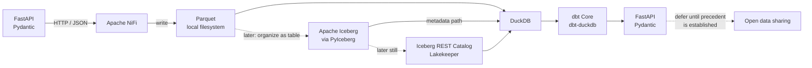
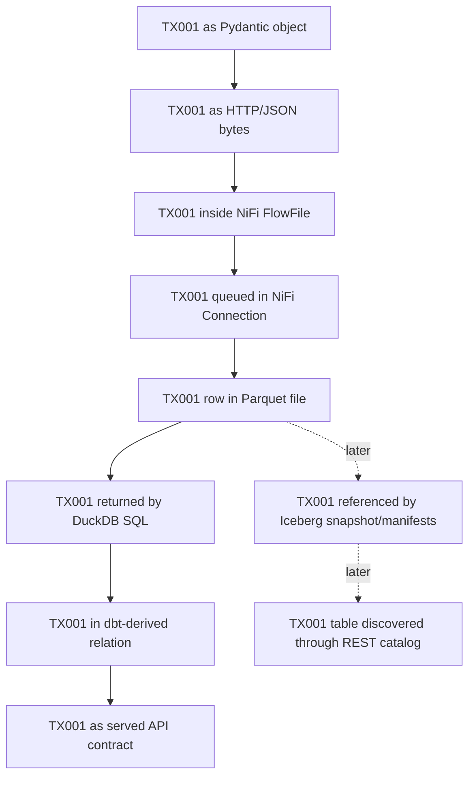

# Minimal Local Data Platform Learning Lab — Initial Research Brief

This document preserves the **initial research evidence state** for the minimal local data-platform learning lab. It is not the final architecture. It records the first research agent's evidence, recommendations, uncertainty, and proposed learning sequence before independent challenge and reconciliation.

The repository's governing constraint is stronger than “build a modern stack”: it is to maximize understanding per line of code and learner minute, introduce roughly one observable concept per Git commit, trace `TX001` continuously, and refuse unsupported integrations. See [`AGENTS.md`](../AGENTS.md), [`docs/learning-governance.md`](../docs/learning-governance.md), and [`prompts/deep-research.md`](../prompts/deep-research.md).

The original architecture hypothesis is mostly sound at the conceptual level, but too large if instantiated all at once. The most important research conclusions are:

1. **Keep Apache NiFi.** Its runtime cost is justified because its FlowFile/connection model exposes queued data, routing, backpressure, retries, and provenance directly, and Snowflake explicitly states that Openflow is built on Apache NiFi. Local NiFi is therefore useful for the underlying mental model, not as a simulator for every Openflow behavior. See the [Apache NiFi User Guide](https://nifi.apache.org/nifi-docs/user-guide.html) and [Snowflake's Openflow release documentation](https://docs.snowflake.com/en/en/release-notes/2025/other/2025-05-20-openflow).
2. **Remove MinIO from the initial path.** A plain local filesystem teaches physical files with almost no infrastructure. In addition, the current [`minio/minio`](https://github.com/minio/minio) upstream repository states that the project is no longer maintained in its historical community-server form and that community distribution is source-only. That materially weakens old “drop in a MinIO container” examples as the foundation for a new lab.
3. **Teach Parquet before Iceberg, and Iceberg before a remote catalog.** The [Apache Parquet file-format documentation](https://parquet.apache.org/docs/file-format/) exposes the physical file structure. The [Apache Iceberg specification](https://iceberg.apache.org/spec/) then makes table state inspectable through metadata, snapshots, manifest lists, manifests, and data files.
4. **Use PyIceberg's documented local SQL catalog plus local filesystem for the first real Iceberg lesson.** Apache's [PyIceberg getting-started material](https://py.iceberg.apache.org/) demonstrates a local SQL catalog backed by SQLite with a local filesystem warehouse for testing, without requiring a separate catalog service or object store.
5. **Keep DuckDB central.** DuckDB directly queries and introspects Parquet, can read Iceberg from metadata without a catalog, and supports catalog-managed Iceberg when a REST catalog is attached. That makes it unusually effective for exposing the boundaries between file, table format, catalog, and compute. See [DuckDB Parquet documentation](https://duckdb.org/docs/current/data/parquet/overview), [Parquet metadata inspection](https://duckdb.org/docs/current/data/parquet/metadata), and the [DuckDB Iceberg extension](https://duckdb.org/docs/current/core_extensions/iceberg/overview).
6. **Keep dbt Core + dbt-duckdb, but only after plain SQL is understood.** The maintained [`duckdb/dbt-duckdb`](https://github.com/duckdb/dbt-duckdb) adapter supports an in-memory or persistent local DuckDB database and external files. dbt then adds an inspectable transformation/test layer rather than becoming the first place the learner sees SQL.
7. **Defer Lakekeeper, object storage, and Delta Sharing.** Lakekeeper has credible DuckDB integration precedent, but its upstream development examples introduce much more infrastructure than the first catalog lesson needs. Delta Sharing has an official protocol and reference implementation, but no authoritative example was found tying that reference server to this exact fully local storage topology. Unsupported integration must not be invented. See the [Delta Sharing repository](https://github.com/delta-io/delta-sharing).

## Recommended Minimal Architecture

The recommendation is **not one permanently running stack**. It is a curriculum architecture whose components appear only when the concept they teach becomes necessary.

**Proposed lab design:** begin with the upper horizontal path. Add the lower Iceberg/catalog path only after `TX001` has already completed a tiny source → ingestion → Parquet → query → dbt → API round trip.

This architecture deliberately introduces **three storage abstractions at different times** rather than simultaneously:

`Parquet file → Iceberg table metadata → catalog service`

That ordering is directly supported by the underlying standards. Parquet is a column-oriented file format whose file metadata and row-group/column-chunk structure can be inspected in the [Parquet format documentation](https://parquet.apache.org/docs/file-format/) and through DuckDB's [`parquet_metadata`](https://duckdb.org/docs/current/data/parquet/metadata) functions. Iceberg manages collections of files as tables using metadata, snapshots, manifests, and atomic table-state updates, as defined by the [Iceberg specification](https://iceberg.apache.org/spec/). PyIceberg's official documentation demonstrates local SQL-catalog testing without another service, and DuckDB separately demonstrates both catalog-free Iceberg reads and REST-catalog-managed access in the [Iceberg extension documentation](https://duckdb.org/docs/current/core_extensions/iceberg/overview).

**Research recommendation:** do **not** initially put Parquet behind an S3-compatible API. `find`, `ls`, ordinary file paths, and DuckDB's Parquet metadata functions make the physical-file lesson clearer. Object storage becomes worthwhile only when “object key + S3 API + credentials” is itself the concept being learned.

**Research recommendation:** do **not** initially use NiFi's Iceberg capability even though NiFi has an upstream [`PutIcebergRecord`](https://nifi.apache.org/components/org.apache.nifi.processors.iceberg.PutIcebergRecord/) processor. Doing so would collapse “ingest/serialize,” “write an analytical file,” and “commit a table snapshot” into one flow before those distinctions are understood. Likewise, NiFi's ability to transform records does not mean analytical transformation belongs there in this lab.

The strongest correction to the prompt's conceptual distinctions is therefore: **they are responsibility boundaries, not absolute product capability boundaries**. NiFi can transform as well as move data; DuckDB can both persist data and compute; a data-sharing protocol itself can use APIs. The useful lesson is which responsibility is being exercised now and which artifact owns `TX001`, not that products fall into mutually exclusive boxes.

## Decisions

`INCLUDE` means the concept belongs in the planned learning path, though not necessarily in the first commit. `DEFER` means it is deliberately outside the initial vertical slice and needs a concrete trigger. `REJECT` means it should not be used as a lab runtime under the present objective.

| Concept | Technology | Decision | Why | Authoritative foundation |
|---|---|---:|---|---|
| Source API | **FastAPI** | **INCLUDE** | Tiny way to make HTTP requests/responses, JSON, schemas, and validation observable. | [FastAPI request-body tutorial](https://fastapi.tiangolo.com/tutorial/body/) |
| Application contract | **Pydantic** | **INCLUDE** | Teaches application-boundary validation and typed Python objects. Keep it at application/data-contract boundaries. | [Pydantic models](https://docs.pydantic.dev/latest/concepts/models/) and [FastAPI request bodies](https://fastapi.tiangolo.com/tutorial/body/) |
| Transport | **HTTP + JSON** | **INCLUDE** | Already visible with `curl`, has almost zero infrastructure, and directly feeds NiFi's HTTP processor. | [FastAPI request body](https://fastapi.tiangolo.com/tutorial/body/) and [NiFi InvokeHTTP](https://nifi.apache.org/components/org.apache.nifi.processors.standard.InvokeHTTP/) |
| Ingestion / movement | **Apache NiFi** | **INCLUDE** | Higher setup cost than a script, but it earns that cost by exposing FlowFiles, queues/connections, routing, backpressure and provenance as first-class state. | [NiFi User Guide](https://nifi.apache.org/nifi-docs/user-guide.html), [InvokeHTTP](https://nifi.apache.org/components/org.apache.nifi.processors.standard.InvokeHTTP/) |
| Enterprise analogue | **Snowflake Openflow runtime** | **REJECT** | Runtime unnecessary for a local under-the-hood lab. Keep only a conceptual mapping. | [Snowflake Openflow release documentation](https://docs.snowflake.com/en/en/release-notes/2025/other/2025-05-20-openflow) |
| Analytical file format | **Apache Parquet** | **INCLUDE** | Essential to make serialized row data vs columnar analytical file concrete. | [Apache Parquet file format](https://parquet.apache.org/docs/file-format/), [Parquet metadata](https://parquet.apache.org/docs/file-format/metadata/), [DuckDB Parquet metadata](https://duckdb.org/docs/current/data/parquet/metadata) |
| First physical storage | **Local filesystem** | **INCLUDE** | Smaller than an object store and maximally inspectable. PyIceberg's local testing path supports a local filesystem warehouse. | [PyIceberg documentation](https://py.iceberg.apache.org/) |
| Local object store | **MinIO** | **DEFER** | Object-storage semantics are useful but not needed for the first Parquet or Iceberg lesson; current upstream maintenance/distribution status also weakens it as a default dependency. | [`minio/minio`](https://github.com/minio/minio) |
| Open table format | **Apache Iceberg** | **INCLUDE** | Teaches files ≠ tables, snapshots, manifests, atomic commits, evolution, transaction semantics, and metadata-driven partitioning. | [Apache Iceberg specification](https://iceberg.apache.org/spec/) |
| Minimal first Iceberg implementation | **PyIceberg + SQLite catalog + filesystem** | **INCLUDE** | Apache's own Python implementation documents a local SQL catalog for testing without a separate service. | [PyIceberg](https://py.iceberg.apache.org/) |
| Catalog protocol | **Iceberg REST Catalog** | **INCLUDE** | Important for the later “table format ≠ catalog” lesson and for raw catalog HTTP calls. It should come after local Iceberg metadata is understood. | [Iceberg REST Catalog specification](https://iceberg.apache.org/rest-catalog-spec/), [DuckDB Iceberg catalogs](https://duckdb.org/docs/current/core_extensions/iceberg/catalogs) |
| Local REST catalog implementation | **Lakekeeper** | **DEFER** | Genuine and well supported, including DuckDB-specific precedent, but too much infrastructure for the first table-format lesson. | [Lakekeeper repository](https://github.com/lakekeeper/lakekeeper), [DuckDB Iceberg REST catalogs](https://duckdb.org/docs/current/core_extensions/iceberg/iceberg_rest_catalogs) |
| Analytical compute | **DuckDB** | **INCLUDE** | Queries Parquet directly, exposes Parquet metadata, reads Iceberg without a catalog, and attaches REST catalogs later. | [DuckDB Parquet](https://duckdb.org/docs/current/data/parquet/overview), [DuckDB Iceberg](https://duckdb.org/docs/current/core_extensions/iceberg/overview) |
| Transformation | **dbt Core + dbt-duckdb** | **INCLUDE** | Adds SQL models and compiled artifacts after the underlying SQL/database is understood. | [`duckdb/dbt-duckdb`](https://github.com/duckdb/dbt-duckdb), [dbt DuckDB setup](https://docs.getdbt.com/docs/core/connect-data-platform/duckdb-setup) |
| Data tests | **dbt tests** | **INCLUDE** | Makes analytical data-quality assertions visibly different from application-boundary schema validation. | [dbt data tests](https://docs.getdbt.com/docs/build/data-tests) |
| Serving | **Reuse FastAPI + Pydantic** | **INCLUDE** | Reuse the already-understood application boundary rather than adding another serving framework. | [FastAPI request/body model](https://fastapi.tiangolo.com/tutorial/body/) |
| Open sharing | **Delta Sharing** | **DEFER** | The open protocol and official reference server/client are real, but current authoritative evidence does not establish the proposed fully local binding to this exact lab storage path. | [`delta-io/delta-sharing`](https://github.com/delta-io/delta-sharing) |

### Architectural challenge

**NiFi is not unnecessary complexity.** For a generic pipeline it might be; for this curriculum it exposes exactly the otherwise-hidden state the learner wants: queued FlowFiles, relationships, provenance, retry behavior, and backpressure. The [NiFi User Guide](https://nifi.apache.org/nifi-docs/user-guide.html) documents connections as queues, backpressure thresholds, and provenance/lineage inspection.

**MinIO is unnecessary complexity at the beginning.** The file/storage lesson survives intact without it, while a filesystem is easier to inspect. The current [`minio/minio`](https://github.com/minio/minio) status creates a second reason not to make it foundational. This does not mean “never learn object storage”; it means **object storage must earn its own commit**.

**Lakekeeper is a good technology at the wrong point in the sequence.** Its integration legitimacy is strong enough to retain it for later: DuckDB documents Iceberg REST catalogs and Lakekeeper is a real Iceberg REST catalog implementation. But Lakekeeper's upstream examples/development topology introduce ancillary services that can hide the catalog lesson. See the [Lakekeeper repository](https://github.com/lakekeeper/lakekeeper) and [DuckDB Iceberg REST catalog documentation](https://duckdb.org/docs/current/core_extensions/iceberg/iceberg_rest_catalogs).

**PyIceberg is the missing simplifier.** The original hypothesis jumped from Parquet to “Iceberg + REST catalog + Lakekeeper + object storage.” Apache's own Python implementation demonstrates that those concerns are separable. A local SQL catalog plus local filesystem is a materially smaller first Iceberg lesson. See [PyIceberg](https://py.iceberg.apache.org/).

**DuckDB's role is stronger than the original hypothesis implies.** Current DuckDB documentation explicitly separates catalog-free, read-only Iceberg access from catalog-managed access and writing. This gives the lab an unusually clear empirical demonstration of **table format ≠ catalog**. See [DuckDB Iceberg overview](https://duckdb.org/docs/current/core_extensions/iceberg/overview) and [catalogs](https://duckdb.org/docs/current/core_extensions/iceberg/catalogs).

## Missing Concepts

The classifications below are **research recommendations**, not claims that the concepts are unimportant. “Acknowledge only” means the concept should be named and distinguished but should not earn infrastructure yet.

| Missing concept | Classification | How to teach it with the proposed stack |
|---|---|---|
| **Orchestration** | **ACKNOWLEDGE ONLY** | Explain that NiFi can schedule processors and coordinate a flow, but do not equate that with a dedicated cross-system workflow orchestrator. Add such a product only when dependency scheduling/backfills across independent jobs become a learning objective. |
| **Incremental ingestion** | **DEMONSTRATE LATER** | Add a second source response containing one new transaction and make the learner explain what state decides “new.” No new platform is required. |
| **CDC** | **ACKNOWLEDGE ONLY** | A static synthetic HTTP source does not expose a database change log. Introduce CDC only alongside a mutable source whose changes can genuinely be captured. |
| **Idempotency** | **TEACH IMMEDIATELY** | Replay/retry `TX001` and make duplicate consequences visible. Stable `TX001` is exactly the identifier needed for the lesson. |
| **Schema evolution** | **DEMONSTRATE LATER** | Add one field only after the first Iceberg table exists. Iceberg explicitly supports metadata-driven schema evolution. See the [Iceberg spec](https://iceberg.apache.org/spec/) and [PyIceberg](https://py.iceberg.apache.org/). |
| **Transactions** | **DEMONSTRATE LATER** | Teach them at the Iceberg metadata/snapshot boundary rather than adding another database. The [Iceberg spec](https://iceberg.apache.org/spec/) describes metadata commit and isolation behavior. |
| **Partitioning** | **ACKNOWLEDGE ONLY** initially | Three to ten records do not justify performance partitioning. Later inspect Iceberg partition metadata/evolution to learn the abstraction. |
| **Lineage** | **ACKNOWLEDGE ONLY** end-to-end | NiFi provenance can show lineage inside NiFi; do not falsely call that complete cross-system lineage. See [NiFi User Guide](https://nifi.apache.org/nifi-docs/user-guide.html). |
| **Provenance** | **TEACH IMMEDIATELY** | NiFi makes provenance events searchable and inspectable, making this a high-ROI early concept. |
| **Observability** | **TEACH IMMEDIATELY** | Use HTTP responses, NiFi status/queues/provenance, files, DuckDB queries, dbt outputs, and ordinary logs. No dedicated platform is needed. |
| **Retries** | **TEACH IMMEDIATELY** | Force a controlled HTTP failure and trace its relationship/retry behavior in NiFi. See [InvokeHTTP](https://nifi.apache.org/components/org.apache.nifi.processors.standard.InvokeHTTP/) and [NiFi User Guide](https://nifi.apache.org/nifi-docs/user-guide.html). |
| **Backpressure** | **TEACH IMMEDIATELY** | NiFi documents connections as queues with object-count/data-size backpressure thresholds that can stop upstream processing. See [NiFi User Guide](https://nifi.apache.org/nifi-docs/user-guide.html). |
| **Data contracts** | **TEACH IMMEDIATELY** | Pydantic at the FastAPI boundary gives a concrete contract: Python model, JSON validation, JSON Schema/OpenAPI, and validation errors. See [FastAPI request body](https://fastapi.tiangolo.com/tutorial/body/) and [Pydantic models](https://docs.pydantic.dev/latest/concepts/models/). |
| **Data quality** | **DEMONSTRATE LATER** | After transformation exists, add a dbt assertion such as uniqueness/not-null and deliberately make it fail. This prevents contract validation from being confused with analytical data-quality tests. See [dbt data tests](https://docs.getdbt.com/docs/build/data-tests). |
| **Authentication / authorization** | **ACKNOWLEDGE ONLY** initially | Synthetic loopback traffic does not justify an identity system. Make auth real when a remote REST catalog or sharing protocol creates an actual trust boundary. |
| **Secrets** | **ACKNOWLEDGE ONLY** initially | Keep the repo secret-free as governance requires. Credentials become useful to teach when a real trust boundary exists. DuckDB introduces secret objects for authenticated catalogs in its [Iceberg catalog documentation](https://duckdb.org/docs/current/core_extensions/iceberg/catalogs). |
| **Interoperability** | **DEMONSTRATE LATER** | Read the same Parquet and later the same Iceberg table through more than one real implementation. The [Parquet format](https://parquet.apache.org/docs/file-format/) and [Iceberg spec](https://iceberg.apache.org/spec/) are both implementation-independent standards. |
| **Ownership / governance** | **ACKNOWLEDGE ONLY** initially | Make ownership concrete per representation—FastAPI owns response objects, NiFi owns queued FlowFiles, filesystem owns Parquet bytes, Iceberg owns table metadata—without adding a governance platform. |

The requested conceptual distinctions are mostly useful, with qualifications.

**Ingestion ≠ transformation** should be read as an architectural responsibility distinction, not a technical impossibility. NiFi can transform data. For this lab, intentionally constrain it to transport, routing, validation-adjacent handling, and serialization; reserve deliberate analytical SQL transformation for dbt/DuckDB.

**Storage ≠ compute** is similarly conceptual. DuckDB can persist relations as well as compute over external files. The better learning test is: *where are the authoritative bytes for `TX001`, and which component is merely reading them?* DuckDB's external-file support makes this visible.

**Files ≠ tables** and **table format ≠ catalog** are the strongest distinctions. The [Iceberg specification](https://iceberg.apache.org/spec/) explicitly tracks data files through manifests and snapshots, while DuckDB can read Iceberg metadata without a catalog and uses an attached catalog for managed table operations. See [DuckDB Iceberg overview](https://duckdb.org/docs/current/core_extensions/iceberg/overview).

**Schema validation ≠ data-quality testing** is also useful: FastAPI/Pydantic validates an application boundary, while dbt tests evaluate assertions over resulting analytical data. See [FastAPI](https://fastapi.tiangolo.com/tutorial/body/) and [dbt data tests](https://docs.getdbt.com/docs/build/data-tests).

**API serving ≠ data sharing** is a responsibility distinction, not a protocol-family distinction. Both can use HTTP APIs. The lab's FastAPI service owns an application-specific contract, whereas Delta Sharing specifies an interoperable dataset-sharing protocol. See [`delta-io/delta-sharing`](https://github.com/delta-io/delta-sharing).

**Orchestration ≠ data movement** is worth preserving, but NiFi sits near the boundary because processors are scheduled and connected into flows. Do not introduce Airflow merely to make the distinction visually pure; wait for an actual cross-job orchestration problem.

## Canonical Examples

The table distinguishes **authoritative capability documentation** from an actual upstream assembled example. A component existing in two projects is not treated as proof of a supported combined integration.

| Requested combination | Authoritative precedent | Assessment |
|---|---|---|
| **NiFi + HTTP** | [Apache NiFi InvokeHTTP](https://nifi.apache.org/components/org.apache.nifi.processors.standard.InvokeHTTP/) | **Supported upstream capability.** Suitable for the HTTP-ingest stage. |
| **NiFi + Parquet** | NiFi's Parquet support exists upstream; the current distribution may require additional NARs, so exact release configuration must be checked before implementation. The project source is in [`apache/nifi`](https://github.com/apache/nifi). | The capability is authoritative. For a current small bundled HTTP/JSON → Parquet runnable flow: **No reliable authoritative example found.** |
| **DuckDB + Parquet** | [DuckDB Parquet overview](https://duckdb.org/docs/current/data/parquet/overview) and [Parquet metadata functions](https://duckdb.org/docs/current/data/parquet/metadata) | **Strong canonical runnable precedent.** This should be one of the simplest stages. |
| **DuckDB + Iceberg** | [DuckDB Iceberg overview](https://duckdb.org/docs/current/core_extensions/iceberg/overview) | **Strong canonical runnable precedent.** Catalog-free read access is especially useful pedagogically. |
| **Iceberg REST Catalog** | [Apache Iceberg REST Catalog spec](https://iceberg.apache.org/rest-catalog-spec/) and [DuckDB catalog docs](https://duckdb.org/docs/current/core_extensions/iceberg/catalogs) | **Strong protocol precedent.** Keep protocol and implementation conceptually separate. |
| **Lakekeeper + DuckDB** | [Lakekeeper repository](https://github.com/lakekeeper/lakekeeper) and [DuckDB Iceberg REST catalogs](https://duckdb.org/docs/current/core_extensions/iceberg/iceberg_rest_catalogs) | **Strong authoritative precedent.** This is the safest remote-catalog integration in the proposed stack. |
| **MinIO + Iceberg** | Apache Iceberg has official local quickstart precedent using S3-compatible object storage; one relevant official entry point is the [Iceberg Flink quickstart](https://iceberg.apache.org/flink-quickstart/). | **Authoritative precedent exists, but it is not evidence that MinIO is the best 2026 lab default.** Current MinIO upstream status materially changes that decision. |
| **Lakekeeper + MinIO specifically** | Lakekeeper's current upstream examples do not establish MinIO as the canonical minimal pairing. | **No reliable authoritative example found.** Do not infer this combination from separate S3-compatibility claims. |
| **dbt + DuckDB** | [`duckdb/dbt-duckdb`](https://github.com/duckdb/dbt-duckdb) and [dbt DuckDB setup](https://docs.getdbt.com/docs/core/connect-data-platform/duckdb-setup) | **Strong canonical runnable precedent.** |
| **FastAPI + Pydantic** | [FastAPI request-body tutorial](https://fastapi.tiangolo.com/tutorial/body/) | **Strong canonical runnable precedent.** |
| **Open sharing reference server + client** | [`delta-io/delta-sharing`](https://github.com/delta-io/delta-sharing) | **Strong server/client precedent for the protocol itself.** |
| **Delta Sharing reference server + proposed fully local filesystem/MinIO lab** | No verified upstream example was located tying the reference server to this exact local storage topology. | **No reliable authoritative example found.** This blocks integrating `TX001` into a fully local sharing stage today. |

There is also an upstream **NiFi → Iceberg** capability through [`PutIcebergRecord`](https://nifi.apache.org/components/org.apache.nifi.processors.iceberg.PutIcebergRecord/). That is deliberately **not recommended for the first Iceberg stage**. A supported shortcut can still be pedagogically wrong if it hides the transition from file to table metadata that the lab explicitly wants to understand.

### Canonical source guide

The [Apache Parquet file-format documentation](https://parquet.apache.org/docs/file-format/) establishes what is physically in a Parquet file: magic bytes, column chunks, row groups, and file metadata/footer. Its [metadata documentation](https://parquet.apache.org/docs/file-format/metadata/) further distinguishes file metadata from page-header metadata. These are the right sources when the learner asks, “what bytes/metadata make this file Parquet?”

The [Apache Iceberg table specification](https://iceberg.apache.org/spec/) is the canonical source for “files vs tables.” It defines table metadata, snapshots, manifest lists, manifests, data files, schema and partition evolution, optimistic concurrency, and commit semantics.

The [PyIceberg documentation](https://py.iceberg.apache.org/) is particularly important because its local testing path demonstrates that the first Iceberg lesson does not require a REST service or object store. A SQL catalog backed by SQLite and a local filesystem warehouse is a legitimate upstream-supported learning path.

The [DuckDB Parquet documentation](https://duckdb.org/docs/current/data/parquet/overview) is the canonical inspection guide for the physical-file stage. The [Parquet metadata page](https://duckdb.org/docs/current/data/parquet/metadata) exposes row-group, column, statistics, and file metadata. The [DuckDB Iceberg documentation](https://duckdb.org/docs/current/core_extensions/iceberg/overview) then exposes metadata, snapshots, direct catalog-free reads, and the boundary where a catalog becomes necessary for managed access.

The [NiFi User Guide](https://nifi.apache.org/nifi-docs/user-guide.html) establishes the processing model—FlowFiles, processors, relationships/connections, queued work, backpressure, and provenance—rather than merely showing a product UI. Those concepts justify NiFi's place in the lab.

The [Snowflake Openflow documentation](https://docs.snowflake.com/en/en/release-notes/2025/other/2025-05-20-openflow) establishes only the mapping fact needed here: Openflow is built on Apache NiFi. It does **not** justify assuming every local NiFi processor, security behavior, deployment detail, or operational characteristic maps one-to-one into Openflow.

The [FastAPI request-body tutorial](https://fastapi.tiangolo.com/tutorial/body/) establishes the FastAPI/Pydantic boundary: JSON request bodies become validated typed objects, invalid input produces errors, and schemas are documented.

The [`duckdb/dbt-duckdb`](https://github.com/duckdb/dbt-duckdb) repository establishes a genuinely minimal local DuckDB adapter configuration, while the [dbt data-test documentation](https://docs.getdbt.com/docs/build/data-tests) establishes the distinction between an analytical assertion and application-boundary validation.

The [Lakekeeper repository](https://github.com/lakekeeper/lakekeeper) and [DuckDB's Iceberg REST catalog documentation](https://duckdb.org/docs/current/core_extensions/iceberg/iceberg_rest_catalogs) give strong integration evidence for a later remote-catalog lesson. They also expose the complexity warning: a realistic catalog environment can introduce ancillary services that are irrelevant to the first table-format lesson.

The [`delta-io/delta-sharing`](https://github.com/delta-io/delta-sharing) repository is the strongest authority for sharing because it contains protocol documentation and reference client/server implementations. It should be used rather than vendor marketing when the sharing lesson eventually becomes justified.

## Progressive Learning Sequence

The sequence follows the repository's required `propose → implement → commit → inspect → run/inspect → explain → measure → proceed/reinforce/simplify/reconsider` loop. Each stage is intended to be a distinct Git lesson, normally well below the repository's roughly 100 meaningful-line implementation budget. Complexity refers to learner-visible handwritten/runtime burden, not generated files or upstream package size.

**Stage:** Contracted transaction source  
**New concept:** Produce, application data contract, serialization.  
**Technology:** FastAPI + Pydantic + HTTP/JSON.  
**Observable result:** A tiny endpoint produces the stable 3–10-record fixture containing `TX001`; invalid application input visibly fails contract validation.  
**What to inspect:** `curl` response; JSON representation; Python/Pydantic object boundary; validation error; generated OpenAPI/JSON Schema.  
**Authoritative example:** [FastAPI's request-body tutorial](https://fastapi.tiangolo.com/tutorial/body/) documents Pydantic request models, JSON parsing, validation, typed objects, and API schema generation.  
**Complexity:** **tiny**.

**Stage:** First real ingestion hop  
**New concept:** Transport is distinct from source ownership; a record can become a queued flow artifact.  
**Technology:** Apache NiFi `InvokeHTTP`.  
**Observable result:** NiFi fetches the source response and `TX001` exists inside a FlowFile rather than only inside FastAPI.  
**What to inspect:** HTTP request/response; FlowFile content and attributes; processor relationship; connection/queue.  
**Authoritative example:** [NiFi InvokeHTTP](https://nifi.apache.org/components/org.apache.nifi.processors.standard.InvokeHTTP/) and the [NiFi User Guide](https://nifi.apache.org/nifi-docs/user-guide.html).  
**Complexity:** **medium**, because the NiFi runtime is the first substantial infrastructure baseline; the teaching change after bootstrap should remain tiny.

**Stage:** Queue and backpressure  
**New concept:** Queued work and backpressure are not the same thing as source-side request handling.  
**Technology:** Apache NiFi connection/backpressure behavior.  
**Observable result:** Downstream processing is intentionally stopped or constrained and queued FlowFiles accumulate; upstream scheduling responds to the configured threshold.  
**What to inspect:** Queue count/size, connection state, processor status, `TX001` still present in the queue.  
**Authoritative example:** [NiFi User Guide](https://nifi.apache.org/nifi-docs/user-guide.html), which documents connections, queues, and backpressure thresholds.  
**Complexity:** **tiny** once NiFi exists.

**Stage:** Failure, retry, and idempotency question  
**New concept:** Delivery can be retried; retry does not itself prove exactly-once processing.  
**Technology:** FastAPI failure response + NiFi routing/provenance.  
**Observable result:** A deliberate failure leaves a visible event trail; retrying `TX001` raises the question of whether the downstream result would duplicate.  
**What to inspect:** HTTP status, processor relationship, queue, provenance event history, number of downstream representations of `TX001`.  
**Authoritative example:** [InvokeHTTP](https://nifi.apache.org/components/org.apache.nifi.processors.standard.InvokeHTTP/) and [NiFi provenance documentation](https://nifi.apache.org/nifi-docs/user-guide.html).  
**Complexity:** **small**.

**Stage:** First analytical file  
**New concept:** Serialization into a physical analytical file; JSON payload ≠ Parquet file.  
**Technology:** Apache NiFi + Parquet + ordinary local filesystem.  
**Observable result:** The current tiny transaction batch is materialized as a real Parquet file and `TX001` can be found by querying that file.  
**What to inspect:** File path/name and size; Parquet schema/footer/row groups via DuckDB; provenance showing the operation that created the file.  
**Authoritative example:** Apache NiFi provides upstream Parquet support in the [`apache/nifi`](https://github.com/apache/nifi) project; exact current-release packaging/configuration must be verified before implementation. For a canonical current preassembled NiFi HTTP/JSON → Parquet runnable flow: **No reliable authoritative example found.**  
**Complexity:** **small** if the exact NiFi release exposes the required writer with modest bootstrap. The orchestrator must verify this before implementation rather than invent configuration.

**Stage:** Query a file without loading it into a server  
**New concept:** Storage ≠ compute; a query engine can operate directly over a physical file.  
**Technology:** DuckDB + Parquet.  
**Observable result:** SQL directly returns `TX001` from the Parquet file.  
**What to inspect:** `DESCRIBE`, query result, `parquet_schema`, `parquet_metadata`, file metadata, and filename.  
**Authoritative example:** [DuckDB Parquet overview](https://duckdb.org/docs/current/data/parquet/overview) and [metadata functions](https://duckdb.org/docs/current/data/parquet/metadata).  
**Complexity:** **tiny**.

**Stage:** First analytical transformation  
**New concept:** Analytical transformation is a separate responsibility from ingestion.  
**Technology:** dbt Core + dbt-duckdb + DuckDB.  
**Observable result:** One staging/model relation transforms or renames the already-queryable transaction data without changing the ingestion flow.  
**What to inspect:** dbt model SQL, compiled SQL, DuckDB relation, query/result containing `TX001`.  
**Authoritative example:** [`duckdb/dbt-duckdb`](https://github.com/duckdb/dbt-duckdb) documents a minimal profile and local DuckDB operation.  
**Complexity:** **small**.

**Stage:** First data-quality assertion  
**New concept:** Contract/schema validation ≠ assertion over analytical data.  
**Technology:** dbt test + DuckDB.  
**Observable result:** One deliberately violated assertion fails while Pydantic would still consider the record structurally valid.  
**What to inspect:** Test declaration, generated/compiled SQL where exposed, failing row/result, then successful rerun after fixture correction.  
**Authoritative example:** [dbt data tests](https://docs.getdbt.com/docs/build/data-tests).  
**Complexity:** **tiny**.

**Stage:** Serve the transformed representation  
**New concept:** Compute result ≠ application/API representation.  
**Technology:** Existing FastAPI + Pydantic process reading the DuckDB result.  
**Observable result:** An HTTP endpoint serves a typed representation derived from transformed analytical data; `TX001` is visible both in the DuckDB object and API response.  
**What to inspect:** DuckDB row/object, Python object, Pydantic contract, JSON response, OpenAPI.  
**Authoritative example:** [FastAPI request-body/model pattern](https://fastapi.tiangolo.com/tutorial/body/) and [Pydantic models](https://docs.pydantic.dev/latest/concepts/models/).  
**Complexity:** **small**.

At this point the learner has a **complete minimal source → ingest → queue/failure → file → query → transform/test → serve vertical slice** without object storage, a table-format server, catalog server, Spark, or a sharing stack. This is the appropriate point to decide `PROCEED`, `REINFORCE`, `SIMPLIFY`, or `RECONSIDER`, rather than assuming that a running system warrants more technology.

**Stage:** Turn files into a real table  
**New concept:** Files ≠ table; table state exists as metadata/snapshots/manifests.  
**Technology:** Apache Iceberg via PyIceberg local SQL catalog + SQLite + local filesystem.  
**Observable result:** A real Iceberg table containing the transaction data exists without a REST catalog or object store. `TX001` can be traced through data files and Iceberg metadata.  
**What to inspect:** SQLite catalog state; table metadata JSON; current snapshot; manifest list; manifests; referenced Parquet data files.  
**Authoritative example:** [PyIceberg](https://py.iceberg.apache.org/) documents the local SQL-catalog pattern, and the [Iceberg specification](https://iceberg.apache.org/spec/) defines the metadata/snapshot/manifest structure.  
**Complexity:** **small to medium**; one Python implementation is added, but no new service.

**Stage:** Read the table without its catalog  
**New concept:** Table format ≠ catalog; compute can resolve an Iceberg table from table metadata alone for read access.  
**Technology:** DuckDB Iceberg extension.  
**Observable result:** DuckDB reads the Iceberg table from its metadata path and returns `TX001`, without connecting to the PyIceberg SQL catalog.  
**What to inspect:** Metadata path supplied to DuckDB; `iceberg_metadata`; `iceberg_snapshots`; referenced manifests/data files.  
**Authoritative example:** [DuckDB Iceberg overview](https://duckdb.org/docs/current/core_extensions/iceberg/overview) explicitly documents catalog-free read-only table access and metadata/snapshot inspection.  
**Complexity:** **tiny**.

**Stage:** Commit a metadata evolution  
**New concept:** Snapshot/transaction and schema evolution.  
**Technology:** PyIceberg + Iceberg.  
**Observable result:** A small schema change produces a new table state while older data files remain governed by metadata rather than directory convention.  
**What to inspect:** Old/new metadata JSON; schema IDs; snapshots; manifest references; unchanged versus newly created data files.  
**Authoritative example:** [Apache Iceberg specification](https://iceberg.apache.org/spec/) and [PyIceberg](https://py.iceberg.apache.org/).  
**Complexity:** **small**.

**Stage:** Introduce a remote catalog boundary  
**New concept:** A catalog can become a separate network service/protocol rather than an in-process/local metadata index.  
**Technology:** Iceberg REST Catalog + Lakekeeper; DuckDB as consumer.  
**Observable result:** DuckDB discovers/queries a Lakekeeper-managed table through a REST catalog; the learner can distinguish catalog HTTP traffic from Iceberg files and DuckDB compute.  
**What to inspect:** REST requests/responses, catalog namespaces/table identifiers, Lakekeeper logs, table metadata location, physical storage objects/files, DuckDB attached catalog.  
**Authoritative example:** [Iceberg REST Catalog specification](https://iceberg.apache.org/rest-catalog-spec/), [Lakekeeper](https://github.com/lakekeeper/lakekeeper), and [DuckDB Iceberg REST catalog documentation](https://duckdb.org/docs/current/core_extensions/iceberg/iceberg_rest_catalogs).  
**Complexity:** **large relative to the rest of this lab.** This is why it belongs late.

There is intentionally **no proposed fully local Delta Sharing stage** in this build order yet. The protocol/reference implementation is genuine, but the evidence reviewed does not justify a supported path from this exact local lab storage topology to the reference server. Under the repository's grounding rule, the orchestrator should stop at that boundary rather than invent the last hop. **No reliable authoritative example found.**

## Deferred Technology

These are not judgments that the technologies are poor. They apply the repository rule: build the smallest thing that exposes the next important concept. The future-trigger column is a **research recommendation** describing a concrete problem that would cause reconsideration.

| Technology | Initial decision | Concrete future problem that would justify it |
|---|---:|---|
| **Kafka** | **DEFER** | The learner needs a durable, independently consumable event stream with replay semantics and multiple decoupled consumers—not merely one HTTP producer feeding one ingestion flow. |
| **Airflow** | **DEFER** | The lab has multiple independent jobs/services whose dependency scheduling, retries, backfills, or historical reruns can no longer be understood as a NiFi dataflow alone. |
| **Spark** | **DEFER** | A specific lesson requires distributed execution or cross-engine Iceberg interoperability that DuckDB/PyIceberg cannot demonstrate economically. |
| **Distributed compute generally** | **DEFER** | Dataset/workload scale, shuffle behavior, distributed scheduling, or distributed failure recovery becomes the explicit learning question. Three to ten records cannot justify it. |
| **Kubernetes** | **DEFER** | Deployment scheduling, multi-node service lifecycle, reconciliation, scaling, or high availability—not data-platform internals—becomes the learning target. |
| **Terraform** | **DEFER** | There is actual external infrastructure with lifecycle/state that needs repeatable provisioning. A local set of processes/files does not create that need. |
| **Cloud infrastructure** | **DEFER** | IAM, managed object storage, cloud networking, or managed-service boundaries are themselves being compared with already-understood local equivalents. |
| **Dedicated observability platform** | **DEFER** | Direct component state, logs, NiFi provenance, HTTP traffic, and SQL output are no longer sufficient and metrics/traces/SLOs become the explicit lesson. |
| **Dedicated data-quality platform** | **DEFER** | dbt assertions no longer cover the desired quality problem—for example continuous profiling, externally managed rules, or quality monitoring across systems becomes an explicit objective. |
| **Schema registry** | **DEFER** | Multiple independently deployed producers and consumers must negotiate centrally versioned event schemas. One FastAPI/Pydantic JSON boundary does not justify a registry. |
| **MinIO** | **DEFER** | The learner specifically needs S3 API/object-key semantics and a currently supportable local implementation is required. Do not add it merely because “lakehouse” diagrams often show object storage. See [`minio/minio`](https://github.com/minio/minio). |
| **Lakekeeper** | **DEFER until catalog stage** | The learner has already inspected real local Iceberg metadata and now needs to see discovery/commit cross a network REST boundary. |
| **Delta Sharing** | **DEFER** | The learner can already distinguish serving from storage/table/catalog, and an authoritative supported way to expose the lab's own data through the reference protocol has been verified. |
| **Frontend** | **REJECT for current scope** | A human-facing application interface becomes an explicit learning objective. `curl`, SQL, NiFi UI, and generated API docs already expose the current concepts. |

A later object-storage choice should be re-evaluated against current upstream evidence rather than assuming historical MinIO examples remain optimal. Lakekeeper's ecosystem and DuckDB's catalog support evolve; when object-store semantics are authorized, the orchestrator should choose a currently supported, documented pairing rather than carry forward an old diagram by inertia.

## Risks / Weak Evidence

**NiFi → Parquet assembled example.** Current NiFi project evidence establishes Parquet support, but the exact current-release packaging/configuration and a decisive Apache-provided tiny runnable HTTP/JSON → record conversion → Parquet flow were not located. **No reliable authoritative example found.** This is the largest evidence gap in the early path. The orchestrator should verify the exact current NiFi release and required NARs before writing the stage rather than inventing configuration.

**Lakekeeper + MinIO.** Apache Iceberg has authoritative precedent with S3-compatible object storage, and Lakekeeper has authoritative precedent as an Iceberg REST catalog, but those separate facts are not proof of a supported Lakekeeper+MinIO pairing. **No reliable authoritative example found.** Do not synthesize two separate compatibility claims into a canonical integration.

**Fully local Delta Sharing over this stack.** The [`delta-io/delta-sharing`](https://github.com/delta-io/delta-sharing) repository is strong evidence for the protocol and reference implementations. No authoritative upstream example was found binding that reference server to the exact local filesystem/MinIO arrangement proposed here. **No reliable authoritative example found.** Accordingly, sharing is deferred rather than filled with a plausible-looking but ungrounded recipe.

**MinIO has changed materially relative to many older lakehouse examples.** The current [`minio/minio`](https://github.com/minio/minio) upstream status means any orchestrator following an older Docker tutorial must revalidate that dependency rather than assuming the historical distribution model still applies.

**Lakekeeper setup can dominate the lesson.** A realistic catalog environment can introduce storage, database, bootstrap, and client services unrelated to the core question “what does a catalog own?” This is not an argument against Lakekeeper; it is an argument to introduce it only after the learner can already inspect Iceberg metadata without it and to use only a deployment topology explicitly supported by current Lakekeeper documentation.

**The dbt ecosystem has a product distinction worth preserving.** The [`duckdb/dbt-duckdb`](https://github.com/duckdb/dbt-duckdb) project remains the maintained adapter route for **dbt Core** and documents a minimal local profile. The curriculum should therefore name what it is teaching—**dbt Core + dbt-duckdb**—rather than loosely installing whatever “latest dbt” happens to imply. See also [dbt DuckDB setup](https://docs.getdbt.com/docs/core/connect-data-platform/duckdb-setup).

**Iceberg itself is evolving.** The lab does not need the newest format features merely because they exist. The first Iceberg lesson requires only durable concepts such as table metadata, snapshots, manifest lists, manifests, commits, and evolution as defined in the [Iceberg specification](https://iceberg.apache.org/spec/).

**Openflow mapping must remain intentionally shallow.** Snowflake's documentation establishes NiFi ancestry. It does not establish that local NiFi authentication, deployment, processor availability, governance, or operating behavior maps one-to-one to managed Openflow. The safe curriculum claim is: **NiFi teaches the underlying dataflow mental model; Openflow adds managed/product-specific semantics that this lab does not attempt to reproduce.** See [Snowflake Openflow documentation](https://docs.snowflake.com/en/en/release-notes/2025/other/2025-05-20-openflow).

## Orchestrator Handoff

The later orchestrator should treat this initial research brief as a sequence of **evidence-gated experiments**, not an instruction to create a monolithic environment. The repository's existing governance already requires a learner gate after each meaningful commit and a roughly one-concept-per-commit rhythm.

For every stage, the acceptance question should remain the repository's trace invariant:

> **Where is `TX001`? What physical representation is it in? Who owns it? What metadata describes it? How do I inspect it? What operation moved or changed it? What happens when that operation fails?**

A useful expected trace is:

The intended Pentaho-learning payoff is not “replace Pentaho with NiFi.” The proposed lab decomposes responsibilities that a legacy platform may combine:

| Responsibility to recognize | Lab representation |
|---|---|
| application production/contracts | FastAPI + Pydantic |
| transport | HTTP/JSON |
| ingestion, buffering, routing, retries, provenance | NiFi |
| analytical file representation | Parquet |
| physical storage | filesystem first |
| table state over files | Iceberg |
| catalog/discovery/commit service | local PyIceberg catalog first; REST/Lakekeeper later |
| compute/query | DuckDB |
| analytical transformation/tests | dbt Core + dbt-duckdb |
| application serving | FastAPI + Pydantic |
| open data sharing | explicitly deferred |

This decomposition is a **proposed lab design**, not a claim that production systems must divide products this way.

The orchestrator should preserve the following stop conditions:

**Do not add object storage** until the learner can explain a Parquet file on the filesystem and the next concept is specifically object-store semantics.

**Do not add Iceberg** until `TX001` can already be queried directly from Parquet; otherwise “table” and “file” arrive together.

**Do not add Lakekeeper** until the learner can inspect Iceberg metadata/snapshots without it; otherwise “table format” and “catalog” arrive together.

**Do not let NiFi own analytical business transformation.** It may need minimal record conversion/serialization for ingestion, but the first deliberate analytical transformation belongs after plain DuckDB SQL and should be visible in dbt.

**Do not add dbt before plain DuckDB SQL.** The learner should first see what dbt is ultimately arranging and compiling.

**Do not introduce Openflow runtime artifacts.** After NiFi is understood, one short mapping note based solely on Snowflake documentation is enough. See [Snowflake Openflow documentation](https://docs.snowflake.com/en/en/release-notes/2025/other/2025-05-20-openflow).

**Do not implement the Delta Sharing end-to-end hop** until an authoritative example proves a supported local route for this lab's data. **No reliable authoritative example found.**

**Do not fake Iceberg metadata.** The proposed PyIceberg stage exists specifically because Apache provides a real implementation that can generate genuine metadata, snapshots, and manifests without forcing a server stack into the lesson.

**Do not hide infrastructure in generated material.** NiFi exported definitions, lock files, and generated metadata may be large, but repository governance says generated material must be reported separately rather than used to conceal conceptual complexity.

Finally, the recommended decision checkpoints are not “did it run?” but behavioral comprehension:

| Checkpoint | Learner should be able to demonstrate |
|---|---|
| after source | explain Pydantic object vs JSON representation |
| after NiFi | locate `TX001` in FlowFile/queue and predict a failure route |
| after backpressure | explain why queued work stops upstream progress |
| after Parquet | distinguish JSON bytes from Parquet file/schema/footer |
| after DuckDB | explain compute operating over externally stored bytes |
| after dbt | show plain SQL vs model vs compiled result and failing test |
| after serving | distinguish database result from application/API contract |
| after local Iceberg | draw `metadata → snapshot → manifest list → manifest → Parquet` |
| after catalog | explain what DuckDB could read without the catalog and what requires catalog-mediated discovery/commit |
| before sharing | distinguish application serving from interoperable dataset sharing |

That evaluation style follows the repository's stated preference for behavioral evidence—trace, distinguish, predict failure, explain modification—rather than self-reported confidence.

## Quality Audit

| Dimension | Score | Assessment |
|---|---:|---|
| **Scope coverage** | **25 / 25** | All candidate technologies were evaluated; all explicitly listed missing concepts were classified; all “What NOT to Learn Yet” technologies were addressed; every requested integration combination was evaluated; all required deliverable sections are present. |
| **Evidence integrity and claim-source fit** | **27 / 30** | Strong reliance on Apache specifications/docs/repos, official FastAPI/Pydantic material, DuckDB docs/repos, dbt material, Lakekeeper upstream material, Snowflake's own Openflow documentation, Delta Sharing's protocol repo, and current MinIO upstream. Deduction reflects unresolved authoritative runnable precedent for NiFi→Parquet as an assembled flow, Lakekeeper+MinIO, and a fully local Delta Sharing binding. |
| **Decision relevance** | **19 / 20** | Research produces concrete INCLUDE/DEFER/REJECT decisions and changes the original architecture materially: filesystem before object store; PyIceberg before REST catalog; late Lakekeeper; no initial MinIO; sharing evidence gate. One point withheld because the eventual fully local sharing endpoint remains unresolved. |
| **Critical challenge and minimality** | **14 / 15** | NiFi is defended despite complexity; MinIO is challenged based on current upstream status; Lakekeeper is delayed because setup risks obscuring the concept; PyIceberg is introduced as a demonstrably smaller Iceberg path; unnecessary distributed/infrastructure tooling is deferred. One point withheld because the exact smallest supported Lakekeeper deployment was not established. |
| **Learning and orchestrator utility** | **10 / 10** | The sequence is explicitly Git-sized, breadth-first, inspectable, trace-centered, source-gated, and includes stage fields, artifacts, failure observations, complexity, and authoritative examples. |
| **Total** | **95 / 100** | **Passes the 90/100 target.** |

**Known evidence gaps:** current assembled NiFi HTTP/JSON→Parquet runnable precedent; a current authoritative Lakekeeper+MinIO example; and an authoritative fully local Delta Sharing reference-server integration for this exact proposed storage topology. Those gaps are not filled with inferred integrations; each is explicitly reported above using the required evidence-failure language.

**Hard-gate concerns:** **None identified in the initial research brief itself.** Every named technology and concept is addressed; material factual claims are sourced or marked as recommendations/proposed design; unsupported integrations are not presented as supported; and the evidence gaps actively block implementation rather than being papered over. The principal downstream hard-gate risk would be an orchestrator ignoring those blocks and manufacturing a NiFi-Parquet, Lakekeeper-MinIO, or local Delta Sharing recipe without new authoritative evidence.
